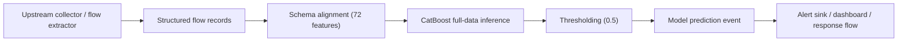

# Kiến trúc Inference Cho IDS

## Mục tiêu

Tầng này chịu trách nhiệm nhận `flow-based features` đã được trích xuất sẵn từ upstream flow extractor, chuẩn hóa đúng schema khi train, chạy mô hình `CatBoost full-data`, áp `threshold = 0.5`, và trả ra quyết định cảnh báo cho IDS.

Nó không sniff packet thô và không tự biến `PCAP` thành feature. Với IDS v1, model boundary luôn bắt đầu từ `structured flow records`.

Mô hình được dùng:

- [catboost_full_data_attempt.cbm](F:/Work/IDS_ML_New/artifacts/kaggle/outputs/catboost_full_data_attempt/catboost_full_data_attempt_results/catboost_full_data_attempt.cbm)

Schema feature:

- [feature_columns.json](F:/Work/IDS_ML_New/artifacts/cic_iot_diad_2024_binary/manifests/feature_columns.json)

Quyết định chốt:

- [final_model_decision.md](F:/Work/IDS_ML_New/docs/current/ml/final_model_decision.md)

## Luồng xử lý



## Ranh giới trách nhiệm

### 1. Feature extraction layer

Lớp này nằm ngoài model inference script hiện tại. Nó có nhiệm vụ:

- nhận traffic ở upstream collector và xuất ra `structured flow records`
- tính ra đúng các cột feature đã dùng khi train
- bảo đảm tên cột và đơn vị đo nhất quán

Nếu lớp này sinh sai schema, model layer phải fail sớm thay vì đoán.

Trong runtime mới, bước này được coi là hệ thống upstream. Service inference chỉ nhận flow record đã có cấu trúc.

### 2. Inference layer

Inference layer chịu trách nhiệm:

- load model
- load danh sách feature columns
- chỉ lấy đúng canonical model features để scoring
- kiểm tra input có đủ cột không
- ép dữ liệu về numeric
- chạy `predict_proba`
- lấy `attack_score`
- áp `threshold = 0.5`
- bỏ qua mọi non-model metadata trong lúc scoring
- trả ra:
  - `attack_score`
  - `predicted_label`
  - `is_alert`

Các khóa ngoài schema như `trace_id`, `sensor_id`, hoặc metadata collector có thể đi cùng input, nhưng chúng chỉ được giữ lại để trace output. Chúng không được đưa vào model scoring.

### 3. Alerting layer

Sau khi có kết quả inference, IDS có thể:

- ghi log JSON
- đẩy event vào SIEM
- hiện dashboard
- hoặc kích hoạt rule phản ứng tiếp theo

Ở giai đoạn hiện tại, lớp này mới dừng ở output dự đoán, chưa gắn vào message bus hay service runtime.

Cần phân biệt rõ:

- `model alerts`: event do model suy ra từ record hợp lệ
- `schema/pipeline anomaly alerts`: event do runtime phát khi record sai schema hoặc ingest lỗi

`schema_anomaly` không phải là dự đoán `Attack/Benign`; nó là tín hiệu vận hành về lỗi input hoặc lỗi pipeline.

## File triển khai

Canonical inference module:

- [ids/runtime/inference.py](F:/Work/IDS_ML_New/ids/runtime/inference.py)

Compatibility entrypoint:

- [ids_inference.py](F:/Work/IDS_ML_New/scripts/ids_inference.py)

Script này hỗ trợ:

- input `CSV`
- input `Parquet`
- output kèm toàn bộ input + cột dự đoán
- hoặc chỉ output cột dự đoán

Lớp realtime mới được mô tả riêng tại:

- [ids_realtime_pipeline_architecture.md](F:/Work/IDS_ML_New/docs/current/runtime/ids_realtime_pipeline_architecture.md)
- [ids/runtime/realtime_pipeline.py](F:/Work/IDS_ML_New/ids/runtime/realtime_pipeline.py)

Compatibility entrypoint:

- [ids_realtime_pipeline.py](F:/Work/IDS_ML_New/scripts/ids_realtime_pipeline.py)

CLI cơ bản:

```powershell
python F:\Work\IDS_ML_New\scripts\ids_inference.py `
  --input-path F:\Work\IDS_ML_New\artifacts\cic_iot_diad_2024_binary\clean\test.parquet `
  --output-path F:\Work\IDS_ML_New\artifacts\demo\test_predictions.parquet `
  --limit 1000
```

## Hành vi hệ thống

### Input hợp lệ

Input phải có đủ đúng `72` feature đã train. Có thể có thêm cột khác, nhưng inference layer chỉ dùng các cột trong schema.

Với realtime pipeline, bước contract layer sẽ:

- normalize alias tên trường nếu nằm trong alias map cho phép
- tách `passthrough metadata`
- chỉ chuyển `72` canonical features vào model

### Input lỗi

Script sẽ fail sớm nếu:

- thiếu cột bắt buộc
- có cột bắt buộc nhưng không ép được sang numeric
- file input không phải `CSV` hoặc `Parquet`

Điều này là chủ ý để tránh silent mismatch giữa train và deploy.

Trong runtime realtime, record lỗi không được fail toàn batch. Thay vào đó, record bị quarantine riêng và phát `schema_anomaly`, còn các record hợp lệ khác vẫn tiếp tục đi qua model.

## Output

Output tối thiểu gồm:

- `attack_score`: xác suất thuộc lớp `Attack`
- `predicted_label`: `Attack` hoặc `Benign`
- `is_alert`: `True/False`
- `threshold`: ngưỡng đang dùng

## Gợi ý tích hợp thực tế

### Prototype / demo

- chạy batch từ file `CSV/Parquet`
- dùng output để làm dashboard hoặc báo cáo minh họa

### Near-real-time IDS

- upstream flow extractor ghi `structured flow records` vào JSONL stream, file sink, hoặc pipe stdin
- realtime pipeline gom `micro-batches` nhỏ
- contract layer quarantine từng record lỗi mà không chấm điểm
- inference service append `attack_score` và `is_alert` cho record hợp lệ
- `model_prediction` và `schema_anomaly` được ghi ra các sink riêng

### Production-hardening cần làm thêm

- đóng gói model + schema + threshold vào config versioned
- thêm logging chuẩn và health check
- đo latency / throughput
- giám sát data drift
- đánh giá lại threshold trên traffic thật
