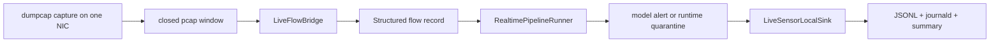

# IDS Live Host-Based Sensor Architecture

## Purpose

This document describes the staged-live Linux sensor that turns the existing IDS runtime into a continuously running host sensor.

The sensor is intentionally narrow:

- capture live traffic on one Linux host and one configured NIC
- process only TCP/UDP flow traffic
- bridge closed capture windows into extractor rows that the adapter normalizes into the canonical flow contract
- reuse the existing adapter, realtime pipeline, and inference stack
- persist local alert, quarantine, and telemetry outputs

It does not implement Telegram notifications, webhook delivery, SIEM transport, or IPS-style response.

## Locked v1 boundary

The architecture follows the locked decisions from `history/ids-live-host-based-ml-ids/CONTEXT.md`:

- live traffic first, not PCAP replay first
- one host, one interface
- end-to-end composition through alert/quarantine
- continuous daemon operation under supervisor control
- fail fast on fatal capture/runtime faults
- local JSONL and journald outputs only
- TCP/UDP flow traffic only
- host-based sensing, not SPAN/mirror-port sensing
- persist only positive alerts and quarantine events as full records

## Runtime shape

The daemon in [scripts/ids_live_sensor.py](F:/Work/IDS_ML_New/scripts/ids_live_sensor.py) composes four layers:

1. `RollingDumpcapCaptureManager` creates closed capture windows.
2. `LiveFlowBridge` runs the extractor command prefix on each closed window and adapts rows.
3. `RealtimePipelineRunner` validates the frozen 72-feature contract and runs inference.
4. `LiveSensorLocalSink` writes local alerts, quarantines, and summaries.

The daemon keeps the capture, bridge, runtime, and sink contracts separate so that failures stay observable:

- capture failures are restart-worthy
- extractor failures are window-stage issues
- adapter/runtime record problems are quarantined
- benign predictions are counted, not persisted as full records

The runtime layer is not forced to finalize on every closed capture window.

- each adapted record still gives the runtime a chance to flush on its own batch-size or flush-interval controls
- the daemon only forces a final runtime drain when the session closes or fails
- that keeps the latency model aligned with `capture window + extractor runtime + runtime flush interval`

## Flow semantics

The sensor only promotes closed-window output into the model path.

- `dumpcap` produces rolling closed windows.
- The bridge invokes the configured extractor command prefix on a closed window.
- The extractor output is adapted into the same 72-feature contract the runtime already expects.
- Valid records reach the realtime pipeline.
- Invalid records are quarantined before scoring.

That separation keeps the live sensor compatible with the existing downstream ML stack instead of replacing it.

## Local output contract

The sensor writes three local output streams:

- alert JSONL
- quarantine JSONL
- summary JSONL plus compact stdout summary lines collected by journald

The local sink is the source of truth for v1. It records:

- positive alerts
- quarantine events
- benign prediction counters
- skipped non-TCP/UDP counters
- extractor failures
- queue depth and oldest-pending-window age
- runtime and capture-window telemetry

Summary formatting is separate from summary transport:

- JSONL summaries are durable forensic artifacts
- compact summary lines are emitted to stdout
- the sample systemd unit routes stdout/stderr into journald for quick inspection

## Dependency and preflight contract

The packaging layer must prove the sensor can start before the daemon loop runs.

Required runtime pieces:

- `dumpcap`
- the configured extractor command prefix
- the final model bundle
- writable spool and log paths

The sample service unit in [deploy/systemd/ids-live-sensor.service](F:/Work/IDS_ML_New/deploy/systemd/ids-live-sensor.service) calls [ids_live_sensor_preflight.py](F:/Work/IDS_ML_New/scripts/ids_live_sensor_preflight.py) so deployment fails early if one of those dependencies is missing. The preflight boundary keeps the extractor dependency explicit and separate from the adapter/runtime contract.

## Filesystem layout

The recommended sample layout is:

- `/opt/ids_ml_new` for the checkout and scripts
- `/var/lib/ids-live-sensor` for spool and closed-window artifacts
- `/var/log/ids-live-sensor` for local JSONL outputs and journald-friendly summaries

The daemon may create subdirectories inside the spool root, but the root paths themselves should be owned by the service account and writable before the process starts.

## Operational posture

The service is a continuously running Linux process, not a manual demo command.

Operational rules:

- if a record is malformed, quarantine it and continue
- if capture or runtime invariants break, fail fast and let the supervisor restart
- keep the output surface local-first
- keep Telegram and IPS out of v1

## Deferred features

These remain out of scope for this feature:

- Telegram notifications
- webhook or SIEM forwarding
- IPS or automatic response
- multi-host deployment abstraction
- SPAN/mirror-port sensing
- non-TCP/UDP scoring

## Related code

- [scripts/ids_live_sensor.py](F:/Work/IDS_ML_New/scripts/ids_live_sensor.py)
- [scripts/ids_live_capture.py](F:/Work/IDS_ML_New/scripts/ids_live_capture.py)
- [scripts/ids_live_flow_bridge.py](F:/Work/IDS_ML_New/scripts/ids_live_flow_bridge.py)
- [scripts/ids_live_sensor_sinks.py](F:/Work/IDS_ML_New/scripts/ids_live_sensor_sinks.py)
- [scripts/ids_realtime_pipeline.py](F:/Work/IDS_ML_New/scripts/ids_realtime_pipeline.py)
- [docs/ids_realtime_pipeline_architecture.md](F:/Work/IDS_ML_New/docs/ids_realtime_pipeline_architecture.md)
- [docs/ids_record_adapter_architecture.md](F:/Work/IDS_ML_New/docs/ids_record_adapter_architecture.md)
