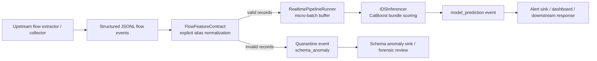

# Kiến Trúc Realtime Pre-Model Pipeline Cho IDS

## Mục tiêu

Tài liệu này mô tả lớp runtime mới nằm trước model IDS v1: nhận `structured flow records` từ upstream extractor, kiểm tra record theo đúng contract `72` feature, gom record hợp lệ thành `micro-batches`, chạy inference, và tách riêng hai loại output:

- `model alerts` cho record hợp lệ đã được chấm điểm
- `schema/pipeline anomaly alerts` cho record bị quarantine vì sai contract

Pipeline này không sniff packet thô và không tự trích xuất flow từ `PCAP`. Nó chỉ nhận `flow records` đã được upstream collector/extractor chuẩn bị sẵn.

## Quyết định khóa đang được giữ nguyên

- `D1`: model input chuẩn của IDS v1 là `flow records`, không phải `PCAP` hay log text tự do.
- `D2`: service inference đứng sau upstream collector/extractor; không làm packet capture.
- `D3`: xử lý theo `micro-batches` gần realtime thay vì batch offline lớn.
- `D4`: record không khớp chính xác schema `72` feature bị quarantine và phát `schema_anomaly`, không được chấm điểm bởi model.

## Luồng end-to-end



## Runtime entry modes

Canonical module:

- [ids/runtime/realtime_pipeline.py](F:/Work/IDS_ML_New/ids/runtime/realtime_pipeline.py)

Compatibility entrypoint:

- [ids_realtime_pipeline.py](F:/Work/IDS_ML_New/scripts/ids_realtime_pipeline.py)

Runtime hỗ trợ hai chế độ input:

- `--input-path <flows.jsonl>`: đọc file JSONL chứa từng `structured flow record`
- `stdin`: fallback cho stream JSONL khi không truyền `--input-path`

Output mặc định là hai file JSONL:

- `*_alerts.jsonl` hoặc `ids_alerts.jsonl`
- `*_quarantine.jsonl` hoặc `ids_quarantine.jsonl`

CLI ví dụ:

```powershell
python F:\\Work\\IDS_ML_New\\scripts\\ids_realtime_pipeline.py `
  --input-path F:\\Work\\IDS_ML_New\\path\\to\\flows_72_features.jsonl `
  --bundle-root F:\\Work\\IDS_ML_New\\artifacts\\final_model\\catboost_full_data_v1 `
  --max-batch-size 32 `
  --flush-interval-seconds 1.0
```

Lưu ý: fixture tại `artifacts/demo/ids_realtime_pipeline_sample.jsonl` là fixture nhẹ để regression test đường `JSONL -> alert/quarantine`. Nó không tự đại diện cho input production đủ `72` feature để chấm điểm với bundle thật.

## Contract boundary

### Canonical model features

Nguồn schema chuẩn:

- [feature_columns.json](F:/Work/IDS_ML_New/artifacts/final_model/catboost_full_data_v1/feature_columns.json)

`FlowFeatureContract` chỉ chấp nhận record có đủ đúng `72` canonical features sau bước normalize alias. Runtime không tự điền giá trị thiếu, không tự suy diễn feature mới, và không tổng hợp feature dẫn xuất ở lớp này.

### Alias policy

Alias chỉ là `one-to-one field-name normalization` cho một tập tên đã khai báo sẵn trong:

- [ids/core/feature_contract.py](F:/Work/IDS_ML_New/ids/core/feature_contract.py)

Các ràng buộc chính:

- chỉ map tên trường, không biến đổi semantics
- thiếu canonical feature vẫn là lỗi quarantine
- alias collision là input lỗi
- giá trị không ép được sang numeric là input lỗi

### Passthrough metadata

Record có thể mang thêm khóa ngoài `72` model features, ví dụ `trace_id`, `sensor_id`, `flow_id`, `collector_ts`.

Các khóa này:

- được giữ lại trong `passthrough`
- đi ra cùng alert/quarantine để truy vết
- bị loại khỏi DataFrame scoring
- không tham gia tính `attack_score`

Nói ngắn gọn: metadata được giữ cho observability, nhưng bị loại khỏi model scoring.

## Micro-batch runtime

`RealtimePipelineRunner` giữ buffer các record hợp lệ rồi flush theo ba trigger:

- đạt `max_batch_size`
- vượt `flush_interval_seconds`
- hết stream hoặc shutdown và còn partial batch

Điều này giữ đúng yêu cầu `near-realtime` nhưng vẫn dùng lại được đường inference dạng DataFrame hiện có.

Defaults hiện tại:

- `max_batch_size = 32`
- `flush_interval_seconds = 1.0`

Record lỗi contract không được đưa vào buffer và không được phép chặn các record hợp lệ trong cùng cửa sổ ingest.

## Hai loại output cần phân biệt

### 1. Model-derived attack alerts

Các event hợp lệ sau khi inference được ghi dưới dạng `event_type = "model_prediction"` và chứa:

- `record_index`
- `passthrough`
- `attack_score`
- `predicted_label`
- `is_alert`
- `threshold`

Đây là kết quả do model sinh ra.

### 2. Schema/pipeline anomaly alerts

Các event quarantine được ghi dưới dạng `event_type = "schema_anomaly"` và thể hiện lỗi pipeline hoặc lỗi contract, không phải dự đoán tấn công. Chúng có thể mang các lý do như:

- `missing_required_features`
- `non_numeric_required_features`
- `alias_collision`
- `invalid_json`
- `invalid_record_type`

Các anomaly này phải được xử lý như tín hiệu vận hành hoặc forensic về ingest path, không được hiểu nhầm là `Attack/Benign` prediction.

## Quan hệ với layer inference hiện có

Pipeline mới dùng lại:

- [ids/runtime/inference.py](F:/Work/IDS_ML_New/ids/runtime/inference.py)
- [final_model_bundle.md](F:/Work/IDS_ML_New/docs/current/runtime/final_model_bundle.md)

Điểm khác biệt:

- `ids.runtime.inference` tập trung vào bundle loading, schema-aligned scoring, và output prediction cho batch đã hợp lệ
- `ids.runtime.realtime_pipeline` thêm runtime boundary trước model: ingest JSONL, validate/quarantine per record, micro-batch flush, rồi mới gọi inferencer

Như vậy, batch inference cũ vẫn là lõi scoring, còn realtime pipeline là lớp orchestration quanh lõi đó.

## Vận hành và demo

Đường v1 phù hợp để demo và kiểm thử local vì:

- không cần broker
- không cần packet capture
- không cần dataset nặng lúc chạy thử
- có thể feed JSONL ngắn từ file hoặc pipe stdin

Thứ tự giải thích cho report:

1. upstream collector tạo `structured flow records`
2. runtime normalize alias và enforce schema `72` feature
3. record lỗi bị quarantine thành `schema_anomaly`
4. record hợp lệ đi vào micro-batch
5. model bundle chấm điểm và phát `model_prediction`

## Tài liệu liên quan

- [ids_inference_architecture.md](F:/Work/IDS_ML_New/docs/current/runtime/ids_inference_architecture.md)
- [final_model_bundle.md](F:/Work/IDS_ML_New/docs/current/runtime/final_model_bundle.md)
- [CONTEXT.md](F:/Work/IDS_ML_New/history/ids-pre-model-realtime-pipeline/CONTEXT.md)

## Related adapter layer

- [ids_record_adapter_architecture.md](F:/Work/IDS_ML_New/docs/current/runtime/ids_record_adapter_architecture.md) documents the upstream adapter that normalizes CICFlowMeter-like records before this runtime consumes them.
