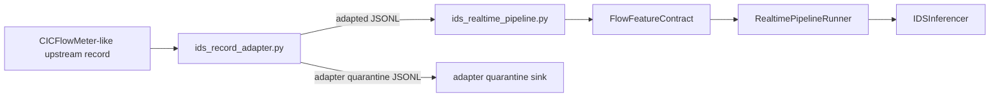

# IDS Structured Record Adapter Architecture

## Purpose

The structured record adapter sits upstream of `ids_realtime_pipeline.py`. Its job is narrow:

- accept CICFlowMeter-like structured records
- normalize profile-specific field names and envelope metadata
- coerce numeric feature values
- validate against the frozen 72-feature contract
- emit either a runtime-ready adapted record or an adapter quarantine record

It does not do packet capture, flow extraction, feature invention, or generic schema translation.

## Locked boundary

The adapter follows these fixed rules:

- explicit profile selection only
- one primary profile and one secondary profile
- one-to-one field mapping only
- no defaulting or imputation for missing model features
- direct output at the model-facing 72-feature boundary
- quarantine instead of silent drop for unmappable records

## Profiles

The v1 registry contains:

- `cicflowmeter_primary_v1`
- `cicflowmeter_secondary_v1`

The profiles are intentionally close:

- both are CICFlowMeter-like
- both target the same 72 canonical model features
- they differ only in source field names and a few metadata envelope keys

The adapter keeps this difference explicit so profile handling stays predictable. The shipped profiles are closed contracts:

- accepted upstream keys are declared explicitly by each profile
- the accepted source-key surface is directly inspectable from each profile definition, including controlled extras
- renamed CICFlowMeter-like fields must arrive under the profile-specific source key, not the canonical model key
- canonical-only or hybrid canonical/profile payloads are quarantined instead of silently falling back
- there is no public canonical-fallback toggle in the v1 profile API

## Output shapes

### Adapted record

Successful adaptation produces a flat JSON object with:

- the 72 canonical feature columns
- `adapter_profile`
- fixed normalized metadata keys:
  - `source_flow_id`
  - `source_collector_id`
  - `source_timestamp`
- controlled extras such as `flow_family`, `transport_family`, and `capture_mode`

These records are already consumable by `ids_realtime_pipeline.py`.

The fixed adapter metadata keys are adapter-owned output fields. Upstream payloads cannot set `adapter_profile`, `source_flow_id`, `source_collector_id`, or `source_timestamp` directly; those values must come from the selected profile mapping and adapter state.

### Adapter quarantine record

Unmappable input is emitted as adapter-specific quarantine JSONL with shared minimum fields:

- `profile`
- `reason`
- `record_index`
- `source_record`

The quarantine payload also carries optional detail such as:

- `missing_fields`
- `non_numeric_fields`
- `alias_collisions`
- `metadata`
- `controlled_extras`

For both CLI streaming mode and file mode, quarantine output is redacted by default so raw payloads do not spill into shared collectors or sidecar files accidentally. The library surface follows the same rule: `AdapterQuarantineRecord.to_event()` redacts `source_record`, `metadata`, and `controlled_extras` unless the caller explicitly opts into raw output. Full raw `source_record` emission from the CLI is opt-in via `--include-raw-quarantine-source`.
If a quarantined record has no mapped metadata or controlled extras, those fields stay empty instead of emitting contradictory placeholder-redaction payloads.

## Composition with the runtime

The handoff is intentionally flat:

The runtime keeps its own contract boundary:

- it validates the 72 canonical features
- it preserves passthrough metadata for observability
- it quarantines malformed runtime input separately from model scoring

That means the adapter stops at the model-facing record boundary, and the runtime starts at the already-adapted JSONL record boundary.

## CLI modes

The adapter CLI supports both:

- stdin/stdout streaming
- file-path input and output

In file mode, adapted output and quarantine output can be written to separate JSONL files. In stream mode, adapted records flow to stdout and quarantine records flow to the configured error stream or quarantine sink.

Additional CLI behaviors:

- file mode defaults to `<input-stem>_adapted.jsonl` and `<input-stem>_adapter_quarantine.jsonl` when output paths are omitted
- both file mode and stdin mode reject identical adapted/quarantine sink paths before opening any output handle
- file mode also rejects `input == quarantine` collisions before opening any output handle
- quarantine output is redacted by default in both file and stream modes; `--include-raw-quarantine-source` is required for full raw payload capture
- profile selection is explicit for both CLI and library use; there is no silent default profile
- JSONL lines over `1 MiB` are quarantined before JSON decoding with reason `jsonl_line_too_large`

## Core composition

The reusable adapter core does not read repo-local artifact files or mutate repo-root import paths at module import time. Repo-specific wiring stays in the CLI composition layer, while library callers can construct `StructuredRecordAdapter` with explicit contract and profile dependencies.

## Demo fixtures

See [artifacts/demo/README.md](F:/Work/IDS_ML_New/artifacts/demo/README.md) for the lightweight adapter demo samples:

- `ids_record_adapter_primary_sample.jsonl`
- `ids_record_adapter_secondary_sample.jsonl`

Those fixtures are synthetic and intentionally small. They exist to exercise profile naming, quarantine behavior, and runtime handoff without copying production traffic.

## Code references

- [scripts/ids_record_adapter.py](F:/Work/IDS_ML_New/scripts/ids_record_adapter.py)
- [tests/test_ids_record_adapter.py](F:/Work/IDS_ML_New/tests/test_ids_record_adapter.py)
- [scripts/ids_realtime_pipeline.py](F:/Work/IDS_ML_New/scripts/ids_realtime_pipeline.py)
- [docs/ids_realtime_pipeline_architecture.md](F:/Work/IDS_ML_New/docs/ids_realtime_pipeline_architecture.md)
