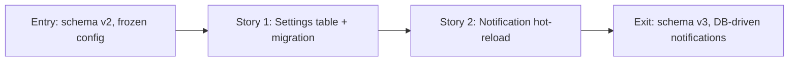

# Phase Contract: Phase 1 - Settings Schema and Notification Hot-Reload

**Date**: 2026-04-04
**Feature**: ids-console-telegram-settings-and-deploy-readiness
**Phase Plan Reference**: `history/ids-console-telegram-settings-and-deploy-readiness/phase-plan.md`
**Based on**:
- `history/ids-console-telegram-settings-and-deploy-readiness/CONTEXT.md`
- `history/ids-console-telegram-settings-and-deploy-readiness/discovery.md`
- `history/ids-console-telegram-settings-and-deploy-readiness/approach.md`

---

## 1. What This Phase Changes

After this phase lands, the operator console's SQLite database can store Telegram bot token and chat ID as key-value settings. The notification worker reads these settings from the database at the start of every poll cycle (every 30 seconds) and uses them to send notifications — even if the worker process was originally started with no Telegram configuration in the environment. If the database has no settings, the worker falls back to whatever was provided via environment variables at startup. Schema migration from v2 to v3 is automatic and backward-compatible: existing v2 databases get upgraded the first time `ids-operator-console-manage migrate` runs after the update.

---

## 2. Why This Phase Exists Now

- The settings UI (Phase 2) needs a database table to save to and read from. Without this schema, the UI has nowhere to persist settings.
- The notification worker needs to reload settings from the database each cycle. Without this change, settings entered via UI would have no effect until the service is restarted — defeating the purpose of the feature.
- This is the proven "foundation-first" pattern from the console UI rebuild (critical-patterns.md): deliver the data layer with passing tests before building any UI on top.

---

## 3. Entry State

- Schema version is 2 (tables: sensors, alerts, admin_users, admin_sessions, notification_deliveries, plus indexes)
- Notification worker receives a frozen `NotificationRuntimeConfig` at startup; if `telegram` is `None`, notifications are permanently disabled for the process lifetime
- `config.py` loads Telegram settings from env vars or secret files only
- No `console_settings` table exists
- 142 tests pass from the previous console UI rebuild

---

## 4. Exit State

- Schema version is 3; `console_settings` table exists with `key TEXT PRIMARY KEY, value TEXT NOT NULL, updated_at TEXT NOT NULL`
- `OperatorStore` has `get_setting(key)` and `set_setting(key, value)` methods; `get_setting` returns `None` for missing keys; empty-string values are treated as "not set" by consumers
- `migrate_operator_store()` handles v2→v3 upgrade via a new `_migrate_v2_to_v3()` function that adds the table and stamps the version
- `run_notification_maintenance_cycle()` reads `telegram_bot_token` and `telegram_chat_id` from `console_settings` before the dispatch check; if both are non-empty strings in DB, constructs a fresh `TelegramNotifierConfig` and uses it for the cycle; if either is missing/empty, falls back to `runtime_config.telegram`
- This works even when `runtime_config.telegram` was `None` at startup — the DB lookup happens unconditionally
- `config.py` is NOT modified — stays env-only
- All new code has passing tests; existing 142 tests still pass
- No UI changes, no route changes, no template changes

**Rule:** every exit-state line must be testable or demonstrable.

---

## 5. Demo Walkthrough

An operator (or test script) opens a Python shell, creates an OperatorStore pointing at a v3 database, and calls `store.set_setting("telegram_bot_token", "123:ABCDEF")` and `store.set_setting("telegram_chat_id", "-100999")`. Then runs one notification maintenance cycle with `runtime_config.telegram=None` (simulating a worker that started with no env-file Telegram config) and a mock sender function. The mock sender receives the DB-stored credentials, proving the hot-reload works end-to-end without restart.

### Demo Checklist

- [ ] `store.set_setting("telegram_bot_token", "123:ABC")` succeeds
- [ ] `store.get_setting("telegram_bot_token")` returns `"123:ABC"`
- [ ] `store.set_setting("telegram_bot_token", "456:DEF")` overwrites (upsert)
- [ ] `store.get_setting("nonexistent_key")` returns `None`
- [ ] v2 database migrates to v3 without data loss
- [ ] Notification cycle with `telegram=None` startup config picks up DB values
- [ ] Notification cycle with DB empty falls back to env config
- [ ] All tests pass

---

## 6. Story Sequence At A Glance

| Story | What Happens | Why Now | Unlocks Next | Done Looks Like |
|-------|--------------|---------|--------------|-----------------|
| Story 1: Settings table + migration + get/set | DB can store and retrieve key-value settings; v2→v3 migration works | Table must exist before anything can read/write it | Story 2 can read settings during notification cycle | Tests pass: create table, migrate v2→v3, get/set/upsert, empty-string handling |
| Story 2: Notification worker DB hot-reload | Worker reads DB settings each cycle and uses them even if startup had no Telegram config | Worker must pick up DB changes without restart — this is D1's "immediate effect" requirement | Phase 2 UI saves will actually affect notification behavior | Tests pass: None-startup + DB override, env fallback when DB empty, config priority DB > env |

---

## 7. Phase Diagram

---

## 8. Out Of Scope

- Settings UI page, routes, template — that is Phase 2
- Preflight DB-awareness — that is Phase 2
- config.py changes — deliberately excluded per critical pattern "split runtime from mutation"
- Token encryption in DB — decided against in approach.md (same security model as secret file)
- Deploy audit — that is Phase 3

---

## 9. Success Signals

- `CURRENT_SCHEMA_VERSION = 3` in migrations.py and v2→v3 migration tested
- `OperatorStore.get_setting()` / `set_setting()` work with upsert semantics
- Notification maintenance cycle constructs TelegramNotifierConfig from DB values when available
- Worker with `telegram=None` at startup successfully dispatches using DB-stored config
- All existing 142 tests still pass; new tests added for schema, migration, and hot-reload

---

## 10. Failure / Pivot Signals

- If the v2→v3 migration breaks existing tables or data — stop, investigate before proceeding
- If the notification worker's DB read adds measurable latency to the 30-second cycle — simplify the read (it should be one SQL query, ~0.1ms)
- If modifying `run_notification_maintenance_cycle()` requires changing its public API signature — reconsider the approach (the change should be internal only)
