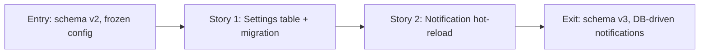

# Story Map: Phase 1 - Settings Schema and Notification Hot-Reload

**Date**: 2026-04-04
**Phase Plan**: `history/ids-console-telegram-settings-and-deploy-readiness/phase-plan.md`
**Phase Contract**: `history/ids-console-telegram-settings-and-deploy-readiness/phase-1-contract.md`
**Approach Reference**: `history/ids-console-telegram-settings-and-deploy-readiness/approach.md`

---

## 1. Story Dependency Diagram

Stories are sequential: Story 2 depends on Story 1 (the table must exist before the worker can read from it).

---

## 2. Story Table

| Story | What Happens In This Story | Why Now | Contributes To | Creates | Unlocks | Done Looks Like |
|-------|-----------------------------|---------|----------------|---------|---------|-----------------|
| Story 1: Settings table + migration | DB gains `console_settings` table with get/set methods; v2→v3 migration upgrades existing databases | Table must exist before any code can read/write settings | Exit state: "schema v3, console_settings table exists, get/set methods work" | `console_settings` DDL, `_migrate_v2_to_v3()`, `get_setting()`, `set_setting()` in OperatorStore, migration tests, DB tests | Story 2 can read `telegram_bot_token` and `telegram_chat_id` from the table | `CURRENT_SCHEMA_VERSION = 3`, migration tested v2→v3, get/set/upsert tested, empty-string returns as value but consumers treat as "not set" |
| Story 2: Notification hot-reload | Notification worker reads DB settings each cycle and uses them to construct a per-cycle TelegramNotifierConfig | This is D1's "immediate effect" requirement — without this, DB-stored settings do nothing | Exit state: "notification worker picks up DB settings without restart" | Modified `run_notification_maintenance_cycle()` with DB lookup before dispatch, hot-reload tests | Phase 2 UI: settings saved via UI will actually affect notification behavior within 30 seconds | Worker with `telegram=None` startup dispatches using DB values; worker with env config gets DB override; empty DB falls back to env |

---

## 3. Story Details

### Story 1: Settings table + migration

- **What Happens In This Story**: The SQLite database gets a new `console_settings` table (key TEXT PRIMARY KEY, value TEXT NOT NULL, updated_at TEXT NOT NULL). OperatorStore gains `get_setting(key) -> str | None` and `set_setting(key, value)` methods using ON CONFLICT upsert. The migration system gains a real `_migrate_v2_to_v3()` function — this is new incremental migration logic since the existing system only handles bootstrap-or-stamp. `CURRENT_SCHEMA_VERSION` bumps from 2 to 3. `inspect_operator_store()` correctly detects v2 databases as needing migration.
- **Why Now**: The table is the absolute foundation. Nothing in this feature can work without it.
- **Contributes To**: Phase exit state — "schema v3, console_settings table exists with tested getters and setters"
- **Creates**:
  - `console_settings` CREATE TABLE in `bootstrap_operator_store()` (db.py)
  - `_migrate_v2_to_v3()` in migrations.py
  - Updated `migrate_operator_store()` to handle v2→v3 case
  - `CURRENT_SCHEMA_VERSION = 3` in migrations.py
  - `OperatorStore.get_setting(key)` method
  - `OperatorStore.set_setting(key, value)` method
  - Tests: fresh bootstrap creates table, v2→v3 migration, get/set/upsert, get nonexistent key returns None, empty-string stores correctly
- **Unlocks**: Story 2 — the worker can now read `telegram_bot_token` and `telegram_chat_id` from `console_settings`
- **Done Looks Like**: All migration tests pass (fresh, v2→v3). All get/set tests pass. Existing tests still pass.
- **Candidate Bead Themes**:
  - Schema DDL + bootstrap + get/set methods in db.py
  - Migration v2→v3 logic + version detection in migrations.py
  - Tests for both

### Story 2: Notification hot-reload

- **What Happens In This Story**: `run_notification_maintenance_cycle()` in `notification_runtime.py` is modified to read `telegram_bot_token` and `telegram_chat_id` from `console_settings` at the start of each cycle. The lookup happens BEFORE the existing `if runtime_config.telegram is not None` guard — it is unconditional. If both DB values are non-empty strings, a fresh `TelegramNotifierConfig` is constructed with those values and used for the dispatch step. If either value is missing or empty, the function falls back to `runtime_config.telegram` (which may be `None`, meaning no dispatch). This means `config.py` is NOT modified — the DB lookup lives entirely in `notification_runtime.py`.
- **Why Now**: Without this, settings saved via the UI (Phase 2) would have no effect until the notification service is restarted. D1 requires "immediate effect without restart."
- **Contributes To**: Phase exit state — "notification worker picks up DB settings without restart, even when startup had no Telegram config"
- **Creates**:
  - Modified `run_notification_maintenance_cycle()` with DB settings lookup
  - Helper function `_resolve_telegram_config(store, fallback_config) -> TelegramNotifierConfig | None` in notification_runtime.py
  - Tests: None-startup + DB override works, env-only fallback works, DB > env priority works, empty DB string = not set
- **Unlocks**: Phase 2 — when the UI saves token + chat_id to `console_settings`, the worker picks them up within 30 seconds
- **Done Looks Like**: Test proves worker with `telegram=None` startup successfully dispatches using DB-stored credentials. Test proves env config is overridden by DB. Test proves empty/missing DB falls back to env.
- **Candidate Bead Themes**:
  - `_resolve_telegram_config()` helper + integration into maintenance cycle
  - Hot-reload tests with mock sender

---

## 4. Story Order Check

- [x] Story 1 is obviously first — the table must exist before anything can read from it
- [x] Every later story builds on an earlier story — Story 2 reads from the table Story 1 creates
- [x] If every story reaches "Done Looks Like", the phase exit state should be true — schema v3 exists and the worker picks up DB settings

---

## 5. Story-To-Bead Mapping

> Fill this in after bead creation.

| Story | Beads | Notes |
|-------|-------|-------|
| Story 1: Settings table + migration | `ids_ml_new-1003` (DDL + get/set), `ids_ml_new-byy5` (migration v2→v3) | Sequential: byy5 depends on 1003 |
| Story 2: Notification hot-reload | `ids_ml_new-udg0` (_resolve_telegram_config + cycle integration) | Depends on both Story 1 beads |

Epic: `ids_ml_new-i7oa` (Telegram Settings UI & Deploy Readiness)
