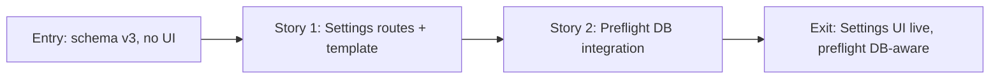

# Story Map: Phase 2 - Settings UI and Preflight Integration

**Date**: 2026-04-04
**Phase Plan**: `history/ids-console-telegram-settings-and-deploy-readiness/phase-plan.md`
**Phase Contract**: `history/ids-console-telegram-settings-and-deploy-readiness/phase-2-contract.md`
**Approach Reference**: `history/ids-console-telegram-settings-and-deploy-readiness/approach.md`

---

## 1. Story Dependency Diagram

---

## 2. Story Table

| Story | What Happens | Why Now | Contributes To | Creates | Unlocks | Done Looks Like |
|-------|-------------|---------|----------------|---------|---------|-----------------|
| Story 1: Settings routes + template + nav | Admin can view, save, clear, and test Telegram settings via the dashboard | This is the feature the user asked for | Exit state: "Settings page in sidebar, masked token, save/clear/test" | settings.html template, GET/POST /settings routes, POST /settings/test route, nav entry, tests | Story 2 (preflight needs settings to already be saveable) | All route/template/CSRF/masking/test-send tests pass |
| Story 2: Preflight DB integration | Preflight opens the DB and accepts stored Telegram config as valid | Service shouldn't warn about missing env config when settings are in DB | Exit state: "Preflight recognizes DB settings" | Modified preflight.py, preflight tests | Phase 3 (deploy audit) | Preflight tests pass for DB-only, env-only, and combined scenarios |

---

## 3. Story Details

### Story 1: Settings routes + template + nav

- **What Happens**: The dashboard gets a /settings page with form for bot token and chat ID. Saves to DB, shows masked token, has Test button.
- **Why Now**: This is the feature the user asked for — D1 (DB persistence) and D2 (masked token + test button).
- **Contributes To**: "Admin can manage Telegram settings from the UI"
- **Creates**: settings.html template, 3 routes (GET /settings, POST /settings, POST /settings/test), PRIMARY_NAV entry, route tests
- **Unlocks**: Story 2 — preflight can now validate settings that were saved via the UI
- **Done Looks Like**: GET /settings shows form with masked token or "Not configured". POST saves/clears. POST /settings/test sends real message. All tests pass.
- **Candidate Bead Themes**: Routes + template + JS handler + tests (single bead — focused scope)

### Story 2: Preflight DB integration

- **What Happens**: operator_console_preflight.py opens the DB and checks console_settings for Telegram credentials.
- **Why Now**: Without this, preflight warns about missing Telegram config even when it's in the DB.
- **Contributes To**: "Preflight recognizes DB-stored config as valid"
- **Creates**: Modified preflight validation, preflight tests
- **Unlocks**: Phase 3 — deploy audit can verify preflight works correctly
- **Done Looks Like**: Preflight passes with DB-only config. Backward-compatible with env-only. Tests prove both paths.
- **Candidate Bead Themes**: Preflight modification + tests (single bead — focused scope)

---

## 4. Story Order Check

- [x] Story 1 is obviously first — must be able to save settings before preflight can validate them
- [x] Every later story builds on an earlier story — Story 2 validates what Story 1 creates
- [x] If every story reaches "Done Looks Like", the phase exit state should be true

---

## 5. Story-To-Bead Mapping

> Fill in after bead creation.

| Story | Beads | Notes |
|-------|-------|-------|
| Story 1: Settings routes + template + nav | `ids_ml_new-ndd4` | Routes + template + JS + tests |
| Story 2: Preflight DB integration | `ids_ml_new-op1z` | Preflight modification + tests. Depends on ndd4 |

Epic: `ids_ml_new-i7oa`
