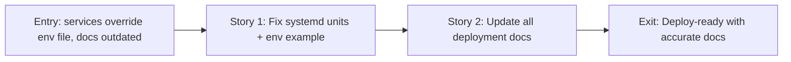

# Story Map: Phase 3 - Deploy Readiness Audit and Fixes

**Date**: 2026-04-04
**Phase Plan**: `history/ids-console-telegram-settings-and-deploy-readiness/phase-plan.md`
**Phase Contract**: `history/ids-console-telegram-settings-and-deploy-readiness/phase-3-contract.md`
**Approach Reference**: `history/ids-console-telegram-settings-and-deploy-readiness/approach.md`

---

## 1. Story Dependency Diagram

---

## 2. Story Table

| Story | What Happens | Why Now | Contributes To | Creates | Unlocks | Done Looks Like |
|-------|-------------|---------|----------------|---------|---------|-----------------|
| Story 1: Fix systemd units + env example | Service units use EnvironmentFile as sole config source. Env example has complete defaults with DB-settings comments. | Hardcoded Environment= lines override admin env file edits, Telegram vars cleared to empty | Exit state: "services work correctly with env file" | Modified service units, updated env example, updated deploy contract tests | Story 2 (docs describe the correct flow) | Deploy contract tests pass, no hardcoded Environment= in services |
| Story 2: Update deployment docs | All docs describe complete flow including Settings UI and DB config precedence | Docs describe only the old env-file approach, creating confusion | Exit state: "docs match reality" | Updated deployment_quickstart.md, README-deploy.md, operations README.md | Feature complete | Docs mention Settings UI, explain precedence, complete golden-path |

---

## 3. Story Details

### Story 1: Fix systemd units + env example

- **What Happens**: Remove all hardcoded `Environment=` lines from `ids-operator-console.service` and `ids-operator-console-notify.service`. Move all default values into `ops/ids-operator-console.env.example` with clear comments. Add comments about DB-settings precedence ("Values set via Settings UI at /settings take precedence").
- **Why Now**: The current systemd units have `Environment=` lines that override `EnvironmentFile=` values. An admin who edits `/etc/ids-operator-console/ids-operator-console.env` will see their changes silently ignored. Additionally, Telegram vars are hardcoded to empty strings, which breaks env-file-based token configuration.
- **Contributes To**: "Service units work correctly with env file customization"
- **Creates**: Modified service units, updated env example, updated deploy contract test assertions
- **Unlocks**: Story 2 — docs can now describe the correct configuration flow
- **Done Looks Like**: Service units only have `EnvironmentFile=` for config. Env example has all variables with sensible defaults and comments. Deploy contract tests updated and passing.

### Story 2: Update deployment docs

- **What Happens**: Update `docs/current/operations/deployment_quickstart.md` with a complete golden-path walkthrough that includes "Configure Telegram via Settings UI." Update `ops/README-deploy.md` Telegram section to explain both approaches (env file for initial/headless setup, Settings UI for ongoing management). Update `docs/current/operations/README.md` to reflect the full operations picture.
- **Why Now**: All deployment docs currently describe only the env-file Telegram approach. The Settings UI exists but is completely undocumented. An operator deploying today would not know about `/settings`.
- **Contributes To**: "Docs match reality"
- **Creates**: Updated docs files
- **Unlocks**: Feature complete — system is deploy-ready with accurate documentation
- **Done Looks Like**: Every doc that mentions Telegram config also mentions the Settings UI. Quickstart has end-to-end walkthrough. No inconsistency between docs and code.

---

## 4. Story Order Check

- [x] Story 1 is obviously first — must fix the service units before documenting the correct flow
- [x] Every later story builds on an earlier story — Story 2 documents the flow that Story 1 makes correct
- [x] If every story reaches "Done Looks Like", the phase exit state should be true

---

## 5. Story-To-Bead Mapping

> Fill in after bead creation.

| Story | Beads | Notes |
|-------|-------|-------|
| Story 1: Fix systemd units + env example | `ids_ml_new-e553` | Service units + env example + test updates |
| Story 2: Update deployment docs | `ids_ml_new-uo58` | Docs updates. Depends on e553 |

Epic: `ids_ml_new-i7oa`
