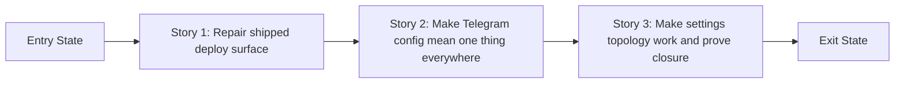

# Phase Contract: Phase 4 - Review closure and release-proof hardening

**Date**: 2026-04-04
**Feature**: ids-console-telegram-settings-and-deploy-readiness
**Phase Plan Reference**: `history/ids-console-telegram-settings-and-deploy-readiness/phase-plan.md`
**Based on**:
- `history/ids-console-telegram-settings-and-deploy-readiness/CONTEXT.md`
- `history/ids-console-telegram-settings-and-deploy-readiness/discovery.md`
- `history/ids-console-telegram-settings-and-deploy-readiness/approach.md`

---

## 1. What This Phase Changes

This phase turns the already-built Telegram settings feature from "mostly working" into something we can actually ship. After it lands, the release tarball is built from an intentional export surface, the Settings page tells the same truth the runtime uses, mounted `/console/...` deployments still work when operators save or test settings, and a fresh install leaves the notification worker plus env-file permissions in the documented production shape.

In practical terms, this phase closes the exact seams that review reopened. It is not adding a new operator capability; it is making the existing capability safe, truthful, and deployment-real.

---

## 2. Why This Phase Exists Now

- Review found one real ship blocker and three follow-up deploy/runtime drifts after the first three phases were already complete.
- If this phase were skipped, the feature would still claim release readiness while the artifact boundary, config truth, proxy-mounted behavior, and install contract remained unreliable.

---

## 3. Entry State

- The DB-backed settings table, Settings page, and notification hot-reload behavior already exist from Phases 1-2.
- The deploy helpers, systemd units, and docs already received an initial readiness pass from Phase 3.
- Review reopened epic `ids_ml_new-i7oa` because four remaining issues show the feature is not genuinely ready to ship yet.
- The approved phase plan now treats this as the final review-closure phase rather than pretending Phase 3 already closed the release/readiness contract.

---

## 4. Exit State

- Release bundles are built from a safe tracked or allowlisted export surface, with proof that ignored or untracked local files do not ship.
- The effective Telegram config contract is shared across runtime, `/settings`, `/settings/test`, and preflight, so DB overrides env while env-only fallback still appears configured and testable.
- Settings save, test, and redirect behavior works under a non-empty `root_path` such as `/console`.
- The install path re-hardens an already-seeded operator env file, enables the notify worker as part of the supported runtime surface, and the final contract-oriented docs/tests describe and prove that corrected behavior.

Every line above must be directly testable or demonstrable.

---

## 5. Demo Walkthrough

An operator can build a release tarball from a checkout that contains local ignored junk and confirm that junk is absent from the artifact. They can then run the console with Telegram configured only through the env file, open `/settings`, see the page truthfully show Telegram as configured, send a test message, and repeat the flow under `/console/settings` without broken URLs. Finally, they can inspect the install/runtime contract and see the notify worker enabled and the operator env file hardened the way the docs now describe.

### Demo Checklist

- [ ] Build the release bundle while a local ignored path exists and confirm the path is absent from the tarball.
- [ ] Run with env-only Telegram fallback and confirm `/settings` plus `/settings/test` behave the same way runtime does.
- [ ] Exercise the Settings flow under a mounted root path such as `/console/settings`.
- [ ] Verify install/runtime proof for env-file hardening, notify-worker enablement, and aligned operator docs.

---

## 6. Story Sequence At A Glance

| Story | What Happens | Why Now | Unlocks Next | Done Looks Like |
|-------|--------------|---------|--------------|-----------------|
| Story 1: Repair the shipped deploy surface | The release tarball and installer stop leaving artifact/install-time surprises. | The feature cannot be called shippable while the product boundary and fresh-install contract are still wrong. | A stable deploy surface that later config and topology proof can trust. | `build_release.sh` no longer packages the raw tree, and install-time hardening/worker enablement are corrected with focused verification. |
| Story 2: Make Telegram config mean one thing everywhere | Runtime, UI, and preflight share one effective `DB > env fallback` interpretation. | Mounted-path fixes and final proof are meaningless if the system still gives operators contradictory answers about Telegram state. | A stable config contract for the Settings surface and final proof. | `/settings`, `/settings/test`, runtime, and preflight all agree on whether Telegram is configured and what source is active. |
| Story 3: Make the settings surface work in real deployed topology and prove closure | Save/Test/redirect behavior honors `root_path`, and final proof/docs close the repaired contract. | This is the last story because it exercises the feature the way a real deployment does after the deploy and config contracts are fixed. | Execution approval and then a real closure review. | Mounted `/console/...` flows work, contract tests prove the repaired surfaces, and docs match the final behavior. |

---

## 7. Phase Diagram

---

## 8. Out Of Scope

- Adding new operator features beyond the already-built Telegram settings surface.
- Replacing the existing tarball plus `install.sh` deployment model with Docker, a new installer, or another packaging strategy outside D4.
- Broad console redesign or unrelated notification architecture changes.

---

## 9. Success Signals

- Review can no longer reproduce the artifact leak, env-fallback UI drift, mounted-path failure, or install/runtime closure gaps.
- A validator can trace one coherent path from phase exit state to stories to beads without guessing how the shipped contract becomes true.
- The demo walkthrough above is credible enough that a reviewer can picture exactly what to verify.

---

## 10. Failure / Pivot Signals

- We cannot choose a safe export-surface strategy for `ops/build_release.sh` without a spike because both tracked-only and allowlist staging leave credible ambiguity.
- The effective Telegram resolver cannot be shared or extracted cleanly enough to keep runtime, UI, and preflight on one contract.
- Mounted-path repair turns out to require a broader routing/public-origin redesign than this phase boundary allows.
- The closure proof still needs warm-worktree assumptions or undocumented operator steps to pass.
