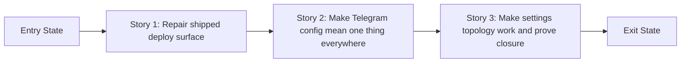

# Story Map: Phase 4 - Review closure and release-proof hardening

**Date**: 2026-04-04
**Phase Plan**: `history/ids-console-telegram-settings-and-deploy-readiness/phase-plan.md`
**Phase Contract**: `history/ids-console-telegram-settings-and-deploy-readiness/phase-4-contract.md`
**Approach Reference**: `history/ids-console-telegram-settings-and-deploy-readiness/approach.md`

---

## 1. Story Dependency Diagram

---

## 2. Story Table

| Story | What Happens In This Story | Why Now | Contributes To | Creates | Unlocks | Done Looks Like |
|-------|-----------------------------|---------|----------------|---------|---------|-----------------|
| Story 1: Repair the shipped deploy surface | The release tarball and fresh-install path stop shipping hidden local junk or leaving the notify/runtime surface half-enabled. | This is first because the feature cannot be called shippable while the artifact and install boundary are still wrong. | Exit-state lines 1 and 4: safe artifact surface plus real install/runtime closure. | A trustworthy release/export surface and a hardened install path. | Story 2 can unify config truth against the actual supported deploy contract. | `build_release.sh` uses a safe export surface, `install.sh` hardens pre-seeded env files, and the notify worker is enabled as part of the supported runtime surface. |
| Story 2: Make Telegram config mean one thing everywhere | Runtime, web, and preflight stop giving competing answers about Telegram configuration. | It belongs second because proxy-path and final proof work should target one stable config contract, not a drifting one. | Exit-state line 2: one shared effective `DB > env fallback` story across the system. | A canonical effective-config path used by runtime/UI/preflight. | Story 3 can exercise mounted settings flows against the final config interpretation. | Env-only fallback shows as configured in `/settings`, `/settings/test` works, and preflight still agrees with runtime. |
| Story 3: Make the settings surface work in real deployed topology and prove closure | The mounted `/console/...` Settings flow works end to end, then the final contract tests and docs prove the repaired system is review-ready. | It closes the phase because this is where the already-repaired deploy and config contracts are exercised in the real supported topology. | Exit-state lines 3 and 4: mounted-path behavior works and closure proof/docs match the final contract. | Root-path-aware settings interactions plus final review-proof surfaces. | Final validation approval and then a true closure review. | Mounted save/test/redirect behavior works, closure-oriented contract proof exists, and operator docs describe the fixed behavior accurately. |

---

## 3. Story Details

### Story 1: Repair the shipped deploy surface

- **What Happens In This Story**: the product boundary stops being "whatever was in the working tree" and the installer stops leaving the documented Telegram runtime partially hardened or partially enabled.
- **Why Now**: a phase about release closure has to fix the artifact/install boundary before anything else can be trusted.
- **Contributes To**: the exit-state requirement that the artifact is safe and the install/runtime closure is real.
- **Creates**: a safe release staging path and a hardened install/runtime surface.
- **Unlocks**: the config-truth story can now be aligned to the actual supported deploy contract, and the final proof can validate a real target shape.
- **Done Looks Like**: `ops/build_release.sh` no longer archives the raw tree, `ops/install.sh` hardens existing env files, and the notify worker is enabled with the rest of the runtime surface.
- **Validation Constraints**:
  - The release helper must export a tracked or explicit allowlisted file set, not just a longer manual exclude list.
  - Generated `wheelhouse/` content is acceptable only as a post-export release artifact layered onto the staged checkout.
- **Candidate Bead Themes**:
  - safe export-surface implementation for the release helper
  - installer hardening plus notify-worker enablement

### Story 2: Make Telegram config mean one thing everywhere

- **What Happens In This Story**: the system reuses one effective Telegram config interpretation instead of letting runtime, UI, and preflight drift apart.
- **Why Now**: if operators still get contradictory answers about Telegram state, mounted-path fixes and final proof will validate the wrong thing.
- **Contributes To**: the exit-state requirement that Settings tells the truth in every supported config shape.
- **Creates**: a shared config-truth contract across runtime, `/settings`, `/settings/test`, and preflight.
- **Unlocks**: the mounted settings flow can be exercised against the final config story rather than an interim implementation.
- **Done Looks Like**: env-only fallback is visible and testable in the UI, DB-overrides-env still holds, and preflight agrees with runtime.
- **Candidate Bead Themes**:
  - shared effective-config resolver reuse or extraction
  - web and preflight contract coverage for env fallback and DB override

### Story 3: Make the settings surface work in real deployed topology and prove closure

- **What Happens In This Story**: the new settings interactions stop assuming a site-root deployment, and the final proof/docs lane confirms the repaired deploy, config, and topology contracts hold together.
- **Why Now**: this is the phase closer because it exercises the feature in the actual mounted/proxied shape the product claims to support after the earlier contract repairs are done.
- **Contributes To**: the exit-state requirement that mounted-path behavior works and the repaired contract is demonstrably closed.
- **Creates**: root-path-aware settings URLs, final proof tests, and aligned deploy docs.
- **Unlocks**: the validator can approve execution for a coherent closure phase, and reviewers can verify one concrete end-to-end story afterward.
- **Done Looks Like**: mounted `/console/settings` save/test/redirect behavior works, closure-oriented contract proof exists, and docs describe the corrected release/install/runtime flow.
- **Validation Constraints**:
  - The closure bead owns shared contract proof plus `docs/current/operations/*` alignment, not a second pass of implementation fixes.
  - Shared proof must cover artifact leakage, install/runtime closure, and final operator-facing docs for the repaired contract.
- **Candidate Bead Themes**:
  - root-path-aware settings interactions in template, JS, and web redirects
  - final closure-proof tests and operator-doc alignment

---

## 4. Story Order Check

- [x] Story 1 is obviously first
- [x] Every later story builds on or de-risks an earlier story
- [x] If every story reaches "Done Looks Like", the phase exit state should be true

---

## 5. Story-To-Bead Mapping

| Story | Beads | Notes |
|-------|-------|-------|
| Story 1: Repair the shipped deploy surface | `ids_ml_new-i7oa.1`, `ids_ml_new-fsoc` | Two worker-sized tasks inside the same deploy-surface story. The current graph serializes them to avoid hidden overlap on deploy-contract proof surfaces. |
| Story 2: Make Telegram config mean one thing everywhere | `ids_ml_new-fhlz` | Single cross-cutting contract bead spanning runtime, UI, preflight, and focused regression coverage. |
| Story 3: Make the settings surface work in real deployed topology and prove closure | `ids_ml_new-yw5l`, `ids_ml_new-i7oa.2` | Root-path repair lands before the final closure-proof/docs bead so reviewers get proof against the final behavior, not an intermediate shape. |

Epic: `ids_ml_new-i7oa`
