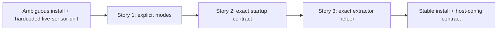

# Phase Contract: Phase 1 - Make Install Modes And Host Config Real

**Date**: 2026-04-05
**Feature**: ids-install-ready-linux-productization
**Phase Plan Reference**: `history/ids-install-ready-linux-productization/phase-plan.md`
**Based on**:
- `history/ids-install-ready-linux-productization/CONTEXT.md`
- `history/ids-install-ready-linux-productization/discovery.md`
- `history/ids-install-ready-linux-productization/approach.md`

---

## 1. What This Phase Changes

This phase turns installation shape from an implicit pile of shell steps into an explicit product choice. After it lands, an operator can choose `console-only` or `full-stack same-host`, run the installer, and get the right host config and live-sensor startup contract for that mode without manual `systemctl edit`, hand-written live-sensor env, shell-wrapped daemon surgery, or default dependence on CICFlowMeter.

---

## 2. Why This Phase Exists Now

- It is obviously first because every later promise depends on one stable install and host-config contract.
- Bundle automation would be unsafe on top of a service/runtime contract that still drifts between hardcoded unit values, ambient env, and manual overrides.

---

## 3. Entry State

- `ops/install.sh` installs one generic shape and optionally bootstraps, but does not expose clear product modes.
- `deploy/systemd/ids-live-sensor.service` still hardcodes critical runtime values via `Environment=` and defaults the extractor to `/opt/cicflowmeter/Cmd`.
- The operator console already proves a better deploy pattern exists: `EnvironmentFile` plus exact-path preflight and canonical package entrypoints.

---

## 4. Exit State

- The installer exposes an explicit choice between `console-only` and `full-stack same-host`, and mode-specific success behavior is documented and testable.
- Live sensor has a seeded host-owned env/config contract consumed by the packaged systemd unit instead of requiring manual service edits for normal configuration.
- The packaged default extractor path is one exact replacement-extractor helper path, and startup semantics for that path are pinned by contract-level verification.

**Rule:** every exit-state line must be testable or demonstrable.

---

## 5. Demo Walkthrough

On a fresh Linux host, an operator runs the installer in `console-only` mode and gets a working control plane with seeded env/secrets and only the relevant services enabled. On another host, the operator runs the installer in `full-stack same-host` mode and sees the live-sensor service wired to a host env file, started through a direct packaged path instead of a shell wrapper, and pointed at one exact packaged replacement-extractor helper path, without touching the unit file manually.

### Demo Checklist

- [ ] Run install in `console-only` mode and confirm console + notification services use seeded host config successfully.
- [ ] Inspect the installed live-sensor service and confirm it reads a host env file instead of relying on hardcoded `Environment=` values for critical settings.
- [ ] Run the live-sensor preflight/startup path with the packaged default extractor contract and confirm one exact replacement-extractor helper path is the normal startup path.

---

## 6. Story Sequence At A Glance

| Story | What Happens | Why Now | Unlocks Next | Done Looks Like |
|-------|--------------|---------|--------------|-----------------|
| Story 1: Make install mode selection explicit | The installer stops behaving like one ambiguous flow and becomes two clear product choices. | This must happen first because every later lifecycle decision depends on what mode the host is supposed to become. | Mode-specific host config and service behavior | `ops/install.sh --help` and install-path tests show clear `console-only` / `full-stack` semantics. |
| Story 2: Make the live-sensor startup contract exact | The live-sensor service reads seeded host config and starts through a direct packaged path instead of a shell-sensitive wrapper. | Once mode behavior exists, the service contract can be normalized around those modes. | Stable runtime surface for default extractor and later bundle automation | The live-sensor unit consumes a host env file and normal host configuration no longer requires `systemctl edit` or `bash -lc` startup hacks. |
| Story 3: Make the replacement extractor the packaged default exact helper | The packaged live-sensor path uses the repo's replacement extractor as one exact helper path and pins its startup semantics. | This closes the biggest remaining Linux setup friction before bundle automation begins. | Safe Phase 2 activation work on top of a stable preflight/runtime path | Preflight/startup use the replacement-extractor helper path by default and exact-path seams are tested. |

---

## 7. Phase Diagram

---

## 8. Out Of Scope

- Automatic shipped-bundle `verify + promote` during install; that belongs to Phase 2.
- Final docs collapse and scrubbed end-to-end install proofs; those belong to Phase 3.

---

## 9. Success Signals

- An operator can explain the difference between `console-only` and `full-stack same-host` by reading installer help or the canonical docs stub, without reverse-engineering shell flags.
- The live-sensor service no longer needs manual override/drop-in edits or shell-wrapper startup hacks for ordinary host configuration, and the packaged replacement extractor helper is the normal path.

---

## 10. Failure / Pivot Signals

- The live-sensor env contract still depends on shell-specific expansion or `bash -lc` to carry startup semantics.
- `console-only` and `full-stack` still share enough hidden behavior that operators would not know what actually changes between them.
- Making the replacement extractor default reopens exact-path or tokenization drift across env file, preflight, and daemon startup boundaries.
