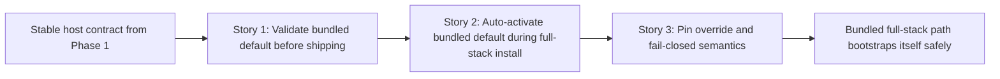

# Phase Contract: Phase 2 - Make The Shipped Full-Stack Path Self-Bootstrapping

**Date**: 2026-04-06
**Feature**: `ids-install-ready-linux-productization`
**Phase Plan Reference**: `history/ids-install-ready-linux-productization/phase-plan.md`
**Based on**:
- `history/ids-install-ready-linux-productization/CONTEXT.md`
- `history/ids-install-ready-linux-productization/discovery.md`
- `history/ids-install-ready-linux-productization/approach.md`

---

## 1. What This Phase Changes

This phase turns the shipped full-stack path into something an operator can trust without post-install bundle surgery. After it lands, a release either refuses to ship a broken default production artifact or ships a tarball that a `full-stack same-host` install can activate through the canonical `verify + promote` lifecycle automatically. If the bundled artifact is missing or invalid, the installer fails closed or forces an explicit operator override instead of leaving a half-ready host behind.

---

## 2. Why This Phase Exists Now

- Phase 1 already stabilized the host contract, so the next operator pain is no longer systemd drift but bundle validity and activation ownership.
- This phase is separate because it mutates production activation state and must sit on top of the already-clean env/service/runtime contract from Phase 1.
- The remaining risk is a trust-boundary bug: build-time validation, install-time activation, and runtime consumption must all stay on one canonical bundle contract.

---

## 3. Entry State

- `ops/build_release.sh` exports a safe tracked tree, but it does not yet fail the build when the shipped default product artifact is invalid.
- `ops/install.sh` can bootstrap the stack, but full-stack install still expects the operator to repair bundle activation by hand after install.
- The canonical lifecycle surfaces already exist: `ids-model-bundle-manage`, the activation record contract, and `ids-stack` bootstrap/preflight surfaces.
- Phase 1 already made the live-sensor env/startup seam exact, so bundle activation can now be layered on without reopening systemd or shell drift.

---

## 4. Exit State

- Release build validates the default shipped production artifact before emitting a release tarball and fails closed if that artifact is invalid.
- `full-stack same-host` install auto-runs the canonical bundle `verify + promote` path when a valid bundled default artifact is present.
- Operators can still point install at an explicit override bundle, and invalid defaults never degrade silently into a host that only looks installed.

**Rule:** every exit-state line must be testable or demonstrable.

### Activation Ownership Matrix

The final bundle activation contract must behave like this:

| Situation | Required behavior |
|-----------|-------------------|
| Bundled default artifact is valid | release build succeeds; `full-stack same-host` install auto `verify + promote`s it |
| Bundled default artifact is invalid | release build fails before shipping, or install fails closed if the invalid artifact somehow reaches it |
| Operator passes explicit override bundle root | installer uses canonical `verify + promote` on that override and does not silently fall back to the broken default |
| `console-only` mode | no bundle activation attempt is made |

Story ownership inside this phase is also fixed:

- Story 1 owns the pre-ship release validation gate for the default artifact.
- Story 2 owns the install-time auto activation path for a valid bundled default.
- Story 3 owns override semantics and fail-closed proof so the full-stack path cannot degrade silently.

### Validating Spike Result

- Spike `ids_ml_new-uxak` returned **YES** for the Phase 2 trust-boundary question: full-stack install can auto-run canonical bundle `verify + promote` safely **only if** install remains a selector of bundle root and does not become a second bundle/activation implementation.
- Hard constraints from that spike:
  - release and install must validate/select the **same explicit bundled default root**
  - installer may select the default or explicit override root, but only `ids-stack bootstrap` may perform bundle verification, promotion, and activation mutation
  - the mutating path must stay on the already-validated interpreter/env contract (`<python> -I -m ...` with scrubbed `PYTHON*` state and `cwd=python_binary.parent`)
  - precedence stays fail-closed: explicit override > bundled default > abort
  - `console-only` never attempts bundle activation

---

## 5. Demo Walkthrough

Build a release from a checkout that contains a valid default bundled production artifact and confirm `ops/build_release.sh` succeeds only after validating that artifact. Then simulate a broken default artifact and confirm the build fails before producing a tarball. On a fresh full-stack host, run the installer without a manual bundle argument and confirm it uses the bundled default artifact through canonical `verify + promote`, producing a real `active_bundle.json`. Finally, rerun with an explicit override bundle root and confirm the installer honors that override rather than silently mixing contracts.

### Demo Checklist

- [ ] `build_release.sh` fails closed when the shipped default artifact is invalid.
- [ ] `build_release.sh` succeeds with a valid default artifact and preserves the safe tracked export surface.
- [ ] `full-stack same-host` install auto-activates the bundled default artifact without a manual post-install bundle CLI step.
- [ ] Explicit bundle override remains supported and does not silently fall back to a broken default.

---

## 6. Story Sequence At A Glance

| Story | What Happens | Why Now | Unlocks Next | Done Looks Like |
|-------|--------------|---------|--------------|-----------------|
| Story 1: Refuse to ship broken defaults | The release builder proves the bundled default artifact is valid before it writes the tarball. | This must happen first because install automation is only trustworthy if the thing being shipped is already valid. | Story 2 can auto-activate a bundled artifact without inventing new trust assumptions. | `ops/build_release.sh` fails before shipping a bad bundled artifact. |
| Story 2: Auto-activate the shipped artifact in full-stack mode | Full-stack install drives canonical `verify + promote` on the bundled default artifact. | Once the shipped artifact is trustworthy, install can own the activation step instead of leaving it to operator repair. | Story 3 can harden override and failure semantics on top of a real activation path. | A valid bundled artifact produces a real `active_bundle.json` during install. |
| Story 3: Keep override and failure semantics explicit | Override bundles stay explicit, and invalid defaults fail closed instead of degrading silently. | After the default path exists, the remaining risk is accidental fallback or mixed activation ownership. | Review and final docs/proof work. | Operators can predict exactly when install activates the default, when it honors an override, and when it aborts. |

---

## 7. Phase Diagram

---

## 8. Out Of Scope

- Final docs/runbook collapse and clean-room operator proof; that belongs to Phase 3.
- Changing the production model contract away from the single activation record.
- Making the two-stage composite bundle the default shipped artifact; that belongs to the companion feature lane.

---

## 9. Success Signals

- A release artifact can no longer ship with a silently broken default bundle.
- A `full-stack same-host` install no longer requires the operator to discover and run a separate bundle activation command after install.
- Override semantics remain explicit enough that future review can reason about one activation contract instead of mixed fallbacks.

---

## 10. Failure / Pivot Signals

- If release validation can be bypassed or a broken bundled artifact still reaches the tarball, the phase has not solved the real trust problem.
- If install activation resolves code, bundle contents, or activation paths through a different contract than the one release validation approved, the phase is reopening the privileged-bootstrap trust bug.
- If override handling silently falls back to the bundled default after a failed override verify, install is degrading instead of failing closed and the phase must stop.
