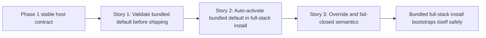

# Story Map: Phase 2 - Make The Shipped Full-Stack Path Self-Bootstrapping

**Date**: 2026-04-06
**Phase Plan**: `history/ids-install-ready-linux-productization/phase-plan.md`
**Phase Contract**: `history/ids-install-ready-linux-productization/phase-2-contract.md`
**Approach Reference**: `history/ids-install-ready-linux-productization/approach.md`

---

## 1. Story Dependency Diagram

---

## 2. Story Table

| Story | What Happens In This Story | Why Now | Contributes To | Creates | Unlocks | Done Looks Like |
|-------|-----------------------------|---------|----------------|---------|---------|-----------------|
| Story 1: Refuse to ship broken defaults | The release builder validates the bundled default product artifact before writing a tarball. | This is obviously first because install automation cannot be trusted until the shipped artifact itself is proven valid. | Exit-state line 1 | A build-time validation gate in the release path | Story 2 | A broken bundled artifact cannot ship as a release tarball. |
| Story 2: Auto-activate the shipped artifact in full-stack mode | The installer runs canonical `verify + promote` for the bundled default artifact during `full-stack same-host` install. | Once the shipped artifact is trustworthy, install can own the activation step safely. | Exit-state line 2 | A real bundled-default activation path during install | Story 3 | A valid full-stack install leaves behind a real `active_bundle.json` without manual bundle surgery. |
| Story 3: Keep override and failure semantics explicit | Override bundle roots stay explicit and invalid defaults fail closed instead of silently degrading. | After the default auto-activation path exists, the remaining risk is ambiguous fallback behavior across release/install/runtime. | Exit-state line 3 | Explicit override/fail-closed regression proof | Review and Phase 3 docs/proofs | Operators can predict when install activates the default, when it honors an override, and when it aborts. |

---

## 3. Story Details

### Story 1: Refuse to ship broken defaults

- **What Happens In This Story**: `ops/build_release.sh` validates the bundled default product artifact through the canonical bundle contract before it emits the tarball.
- **Why Now**: before install automation mutates activation state, the release output itself must become trustworthy.
- **Contributes To**: `Release build validates the default shipped production artifact before emitting a release tarball and fails closed if that artifact is invalid.`
- **Creates**: a pre-ship validation gate and the first point where invalid bundled artifacts are rejected.
- **Unlocks**: Story 2 can activate the bundled artifact during install without inventing a second trust boundary.
- **Done Looks Like**: a good bundled artifact still ships, but a broken bundled artifact fails the release command before a tarball is written.
- **Boundary Lock**: this story owns release validation only. It must not add install-time activation behavior yet.
- **Spike Constraint**: this story must pin one exact bundled default artifact root so release and install reason about the same shipped artifact rather than parallel defaults.
- **Candidate Bead Themes**:
  - extend `ops/build_release.sh` to validate the bundled default artifact before archive emission
  - add release-path tests for valid and invalid bundled default artifacts

### Story 2: Auto-activate the shipped artifact in full-stack mode

- **What Happens In This Story**: the installer uses canonical bundle lifecycle surfaces to `verify + promote` the bundled default artifact during `full-stack same-host` installs.
- **Why Now**: once the build has guaranteed the bundled artifact is valid, install can own activation safely.
- **Contributes To**: `full-stack same-host install auto-runs the canonical bundle verify + promote path when a valid bundled default artifact is present.`
- **Creates**: a real activation record during install and a meaningful difference between `console-only` and `full-stack` at the bundle layer.
- **Unlocks**: Story 3 can now pin override semantics and fail-closed behavior on top of a real activation path.
- **Done Looks Like**: a full-stack install with a valid bundled artifact produces `active_bundle.json` without any manual post-install bundle CLI step.
- **Boundary Lock**: this story owns the bundled-default activation path only. It must not loosen override/failure semantics or add silent fallback behavior.
- **Spike Constraint**: install may choose the candidate bundle root, but only `ids-stack bootstrap` remains allowed to perform `verify + promote` and activation mutation.
- **Candidate Bead Themes**:
  - extend `ops/install.sh` / stack orchestration to auto-activate the bundled default in full-stack mode
  - add install-path proof that activation happens during full-stack mode only

### Story 3: Keep override and failure semantics explicit

- **What Happens In This Story**: the install path proves explicit override handling and fail-closed behavior so broken defaults or overrides cannot silently degrade into a misleading host state.
- **Why Now**: after the default activation path exists, the last risk is ambiguous fallback and split activation ownership.
- **Contributes To**: `Operators can still point install at an explicit override bundle, and invalid defaults never degrade silently into a host that only looks installed.`
- **Creates**: override-path regression proof and explicit error semantics when validation or promotion fails.
- **Unlocks**: final review and the docs/proof phase.
- **Done Looks Like**: install either activates the intended bundle through the canonical path or aborts loudly; it never silently mixes a failed override with the bundled default.
- **Boundary Lock**: this story freezes behavior around the existing activation contract. It does not change the bundle manifest model or introduce a second activation record.
- **Spike Constraint**: precedence must be explicit and fail closed: valid explicit override > bundled default > abort. A failed override must not silently fall through to the bundled default.
- **Candidate Bead Themes**:
  - add fail-closed install-path tests around broken defaults and explicit override bundle roots
  - pin CLI/user-facing semantics so override and bundled-default activation remain unambiguous

---

## 4. Story Order Check

- [x] Story 1 is obviously first
- [x] Every later story builds on or de-risks an earlier story
- [x] If every story reaches "Done Looks Like", the phase exit state should be true

---

## 5. Story-To-Bead Mapping

| Story | Beads | Notes |
|-------|-------|-------|
| Story 1: Refuse to ship broken defaults | `ids_ml_new-1u8h.6` | first release-validation bead; blocks the rest of Phase 2 |
| Story 2: Auto-activate the shipped artifact in full-stack mode | `ids_ml_new-1u8h.9` | depends on `.6` because install automation must sit on a valid shipped artifact |
| Story 3: Keep override and failure semantics explicit | `ids_ml_new-1u8h.7` | depends on `.9` because override/fail-closed proof should freeze the final activation path, not an intermediate one |
