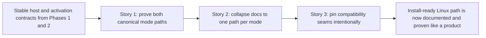

# Phase Contract: Phase 3 - Prove The Product Path End To End

**Date**: 2026-04-06
**Feature**: `ids-install-ready-linux-productization`
**Phase Plan Reference**: `history/ids-install-ready-linux-productization/phase-plan.md`
**Based on**:
- `history/ids-install-ready-linux-productization/CONTEXT.md`
- `history/ids-install-ready-linux-productization/discovery.md`
- `history/ids-install-ready-linux-productization/approach.md`

---

## 1. What This Phase Changes

This phase turns the now-stable install path into an operator-facing product contract that can be trusted. After it lands, there is one canonical documented path for `console-only` and one canonical documented path for `full-stack same-host`, and the repository has clean proof that those documented paths are real instead of aspirational.

---

## 2. Why This Phase Exists Now

- Phase 1 already stabilized the host/service/config contract.
- Phase 2 already stabilized the shipped-bundle and activation contract.
- That means the remaining work is no longer implementation drift; it is proving that the operator story, the compatibility seams, and the docs all reflect the product path exactly.

---

## 3. Entry State

- `console-only` and `full-stack same-host` are real installer modes.
- Live-sensor startup and the packaged replacement extractor now run on one exact host contract.
- Full-stack install now selects the shipped default bundle root safely and keeps canonical `ids-stack bootstrap` as the only mutation path.
- The docs still contain more than one historical/operator recipe, and there is not yet one clean final proof harness for both supported modes.

---

## 4. Exit State

- Operators have exactly one canonical install/runbook path for `console-only` and one canonical path for `full-stack same-host`.
- The repository proves those documented paths in a clean install/proof harness instead of depending on warmed dev state or manual operator repair.
- Compatibility seams that still exist are explicitly documented and regression-pinned as compatibility-only behavior, not accidental primary paths.

**Rule:** every exit-state line must be observable by docs, tests, or both.

### Final Product Matrix

| Mode / Seam | Required behavior |
|-------------|-------------------|
| `console-only` docs | one canonical documented install and readiness path |
| `full-stack same-host` docs | one canonical documented install, activation, and readiness path |
| clean proof harness | both documented paths are exercised without relying on warmed dev state |
| compatibility wrappers / old seams | still-supported behavior is intentionally documented and tested as compatibility-only |

---

## 5. Demo Walkthrough

Hand an operator the docs for `console-only`, follow them literally on a clean proof harness, and confirm the expected checks pass without manual service edits, manual env sourcing, or an undisclosed bootstrap step. Then do the same for `full-stack same-host`, confirming that the documented path matches the shipped bundled-default activation contract. Finally, inspect the compatibility note surface and verify that any remaining wrapper or legacy seam is explicitly labeled and regression-tested instead of silently acting like a second canonical path.

### Demo Checklist

- [ ] `console-only` docs describe one canonical install/readiness flow and the proof harness passes it.
- [ ] `full-stack same-host` docs describe one canonical install/activation/readiness flow and the proof harness passes it.
- [ ] Compatibility seams that remain are intentionally documented and backed by narrow regression proof.

---

## 6. Story Sequence At A Glance

| Story | What Happens | Why Now | Unlocks Next | Done Looks Like |
|-------|--------------|---------|--------------|-----------------|
| Story 1: Prove the two canonical mode paths | The repo gains clean proof that both supported install modes work from a scrubbed harness. | This comes first because docs are only trustworthy once the proof path is real and repeatable. | Story 2 can freeze the docs around a proven path instead of a hoped-for one. | Clean install proof exists for `console-only` and `full-stack same-host`. |
| Story 2: Collapse docs to one canonical path per mode | The docs stop competing with historical recipes and describe the exact product path now supported. | Once proof exists, the docs can safely freeze around the real operator path. | Story 3 can clearly label remaining compatibility seams. | Operators can follow one path per mode without improvisation. |
| Story 3: Pin compatibility seams intentionally | Wrapper and legacy seams that survive are documented as compatibility-only and regression-pinned. | After docs are canonical, the last drift risk is an accidental second path. | Reviewing and final feature closeout. | The product path is singular, and surviving compatibility behavior is explicit instead of accidental. |

---

## 7. Phase Diagram

---

## 8. Out Of Scope

- Making the two-stage composite bundle the default shipped artifact; that belongs to the companion feature lane.
- New deployment topologies such as `.deb`, container-first, or fleet orchestration.
- Reopening installer/service/runtime implementation seams already stabilized in earlier phases unless proof exposes a real regression.

---

## 9. Success Signals

- A new operator can follow the docs literally for each mode without discovering hidden setup steps.
- Clean proof commands exercise the same contract the docs describe.
- Compatibility behavior is intentional and narrow, not an accidental shadow deployment path.

---

## 10. Failure / Pivot Signals

- If the proof harness still depends on warmed repo state, manual operator repair, or hidden env/service overrides, the phase has not closed the product path honestly.
- If the docs still present multiple equivalent recipes for the same mode, the operator contract remains ambiguous and the phase is incomplete.
- If compatibility seams are left undocumented or untested, review will have to guess which path is canonical and which is legacy, and the phase has not actually frozen the product contract.
