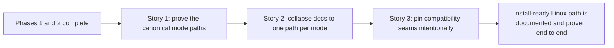

# Story Map: Phase 3 - Prove The Product Path End To End

**Date**: 2026-04-06
**Phase Plan**: `history/ids-install-ready-linux-productization/phase-plan.md`
**Phase Contract**: `history/ids-install-ready-linux-productization/phase-3-contract.md`
**Approach Reference**: `history/ids-install-ready-linux-productization/approach.md`

---

## 1. Story Dependency Diagram

---

## 2. Story Table

| Story | What Happens In This Story | Why Now | Contributes To | Creates | Unlocks | Done Looks Like |
|-------|-----------------------------|---------|----------------|---------|---------|-----------------|
| Story 1: Prove the two canonical mode paths | The repo gains clean install/proof coverage for `console-only` and `full-stack same-host` under the now-stable product contract. | This must happen first because the docs should freeze around proof, not around assumptions. | Exit-state line 2 | A clean proof harness for both supported modes | Story 2 | Both supported modes can be proven from a scrubbed path. |
| Story 2: Collapse docs to one canonical path per mode | Operator-facing docs are rewritten so each mode has one path and one readiness story. | Once proof is real, docs can become precise instead of historical. | Exit-state line 1 | Canonical mode-specific runbooks | Story 3 | An operator can follow one path per mode without choosing between competing recipes. |
| Story 3: Pin compatibility seams intentionally | Compatibility wrappers and surviving legacy seams are documented and regression-pinned as compatibility-only behavior. | After the product path is singular, the remaining risk is accidental shadow paths. | Exit-state line 3 | Intentional compatibility notes plus narrow regression proof | Reviewing / feature closeout | The canonical path is singular and legacy behavior is explicitly bounded. |

---

## 3. Story Details

### Story 1: Prove the two canonical mode paths

- What happens: add or tighten clean install/proof coverage so both supported modes are exercised against the final product contract.
- Why now: this phase should not freeze docs until the proof path is trustworthy.
- Creates: a real operator-proof surface for `console-only` and `full-stack same-host`.
- Unlocks next: docs can safely collapse around the behavior that is now machine-checked.
- Done looks like: proof commands pass for both modes without warmed-state shortcuts or hidden manual repairs.

### Story 2: Collapse docs to one canonical path per mode

- What happens: remove competing install recipes and describe the exact current contract for each supported mode.
- Why now: once proof exists, docs can reflect product truth rather than implementation churn.
- Creates: one operator-facing narrative per mode.
- Unlocks next: compatibility seams can be explicitly labeled against a known canonical path.
- Done looks like: deployment and operations docs point to one path per mode and match the proof harness.

### Story 3: Pin compatibility seams intentionally

- What happens: document and regression-pin wrappers or surviving legacy seams as compatibility-only behavior.
- Why now: once the canonical path is documented, the last drift risk is a second path hiding in wrappers or legacy commands.
- Creates: explicit compatibility boundaries.
- Unlocks next: reviewing can verify one canonical product path and bounded legacy behavior.
- Done looks like: compatibility seams are intentional, documented, and regression-tested instead of accidental.

---

## 4. Story-To-Bead Mapping

- Story 1: `ids_ml_new-1u8h.10`
- Story 2: `ids_ml_new-1u8h.11`
- Story 3: `ids_ml_new-1u8h.12`

---

## 5. Risk Notes For Validating

- Story 1 touches clean install proof and can regress into warmed-state false confidence if it does not stay on the scrubbed install contract.
- Story 2 is mostly docs, but validating should still ensure the docs are collapsing around the proven path rather than preserving historical ambiguity.
- Story 3 must be careful not to blur compatibility-only seams back into the canonical path; validating should check that the bounded legacy note stays explicit.
