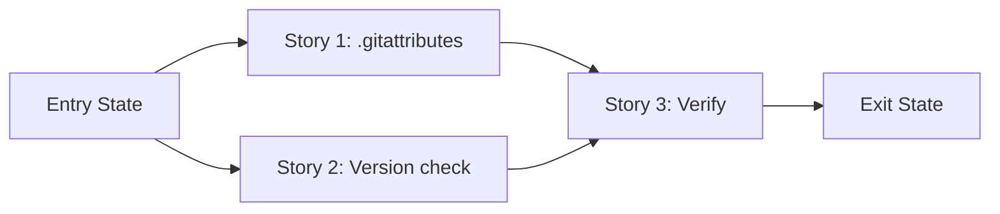

# Phase Contract: Phase 1 - Clean Release Artifact + Installer Hardening

**Date**: 2026-04-04
**Feature**: ids-linux-packaging-and-instructions
**Phase Plan Reference**: `history/ids-linux-packaging-and-instructions/phase-plan.md`
**Based on**:
- `history/ids-linux-packaging-and-instructions/CONTEXT.md`
- `history/ids-linux-packaging-and-instructions/discovery.md`
- `history/ids-linux-packaging-and-instructions/approach.md`

---

## 1. What This Phase Changes

After this phase, running `bash ops/build_release.sh` produces a release tarball that contains only production-needed files — no test suites, no agent coordination artifacts, no historical learnings, no Kaggle configs. The installer also catches a wrong Python version before creating the venv, so operators see a clear error message instead of a cryptic failure five minutes into the install.

---

## 2. Why This Phase Exists Now

- The release tarball and installer are the foundation that Phase 2 documentation will describe. If we write docs first and then change the tooling, the docs drift immediately.
- Without `.gitattributes`, the tarball ships ~40% dev-only content to production hosts where it serves no purpose and increases the surface area.

---

## 3. Entry State

- `ops/build_release.sh` exists and uses `git archive HEAD` (safe export surface)
- `ops/install.sh` exists with full system user creation, venv setup, systemd install, and secret hardening
- No `.gitattributes` file exists in the repo
- The installer does not verify the Python version before creating the venv
- All 3 systemd units, env template, and nginx example are present and correct

---

## 4. Exit State

- `.gitattributes` exists with `export-ignore` rules for dev-only directories
- `git archive HEAD` output does NOT contain: `tests/`, `.khuym/`, `.beads/`, `.spikes/`, `.claude/`, `history/`, `kaggle/`, `design/`, `AGENTS.md`, `wrapper_smoke_support.py`, `tests_editable_install_cache.py`
- `git archive HEAD` output DOES contain: `ids/`, `ml_pipeline/`, `artifacts/final_model/`, `deploy/`, `ops/`, `docs/`, `scripts/`, `pyproject.toml`, `requirements.txt`, `README.md`
- `ops/install.sh` exits with a clear error message if the Python binary version is below 3.11
- `ops/build_release.sh` still works correctly end-to-end

---

## 5. Demo Walkthrough

Run `bash ops/build_release.sh`, extract the produced tarball to a temp directory, and list its contents. Dev directories like `tests/` and `.khuym/` should be absent. Production directories like `ids/` and `deploy/` should be present. Then simulate running the installer with an older Python — it should print a version error and exit before creating any venv.

### Demo Checklist

- [ ] Run `build_release.sh` and extract the tarball
- [ ] Confirm `tests/`, `.khuym/`, `.beads/`, `history/`, `kaggle/` are absent
- [ ] Confirm `ids/`, `deploy/`, `ops/`, `artifacts/final_model/`, `pyproject.toml` are present
- [ ] Run `install.sh` with `--python-bin python3.10` (or equivalent) and see version check failure
- [ ] Run `install.sh` with `--python-bin python3.11` and see it proceed past the version check

---

## 6. Story Sequence At A Glance

| Story | What Happens | Why Now | Unlocks Next | Done Looks Like |
|-------|--------------|---------|--------------|-----------------|
| Story 1: Add `.gitattributes` export-ignore | Dev-only directories excluded from `git archive` | Must come first — it changes the tarball contents | Story 3 can verify the trimmed tarball | `.gitattributes` committed; `git archive HEAD \| tar -tf -` shows no dev dirs |
| Story 2: Add Python version check to installer | Installer rejects Python <3.11 early | Independent of Story 1, can run in parallel | Story 3 can verify the improved installer | `install.sh` with Python 3.10 exits with error message |
| Story 3: Verify release artifact | End-to-end proof that `build_release.sh` + trimmed archive + installer behavior work | Depends on Stories 1-2 being done | Phase 2 documentation | Archive extracted, contents verified, version check confirmed |

---

## 7. Phase Diagram

---

## 8. Out Of Scope

- Writing the Linux prerequisites doc (Phase 2)
- Fixing doc platform syntax (Phase 2)
- Adding `MANIFEST.in` (not needed for editable install deployment path)
- Docker/container packaging (deferred idea)
- Changing the model bundle packaging decision (model stays in tarball)

---

## 9. Success Signals

- `build_release.sh` produces a tarball that's noticeably smaller than before
- Extracted tarball contains exactly the files a production host needs
- Installer catches Python version mismatch before any filesystem changes
- All existing tests still pass

---

## 10. Failure / Pivot Signals

- If `.gitattributes` `export-ignore` breaks `git archive` in an unexpected way (e.g., excluding files needed for the editable install), pivot to a different exclusion mechanism
- If the model bundle is larger than expected and dominates the tarball, reconsider the D4 decision to keep it bundled
- If `scripts/` turns out to have documented user-facing entrypoints that operators depend on, do not exclude it from the archive
