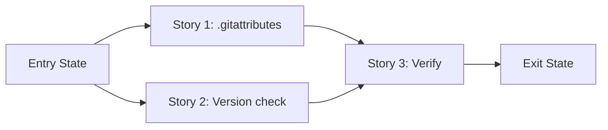

# Story Map: Phase 1 - Clean Release Artifact + Installer Hardening

**Date**: 2026-04-04
**Phase Plan**: `history/ids-linux-packaging-and-instructions/phase-plan.md`
**Phase Contract**: `history/ids-linux-packaging-and-instructions/phase-1-contract.md`
**Approach Reference**: `history/ids-linux-packaging-and-instructions/approach.md`

---

## 1. Story Dependency Diagram

Stories 1 and 2 are independent and can run in parallel. Story 3 depends on both completing.

---

## 2. Story Table

| Story | What Happens | Why Now | Contributes To | Creates | Unlocks | Done Looks Like |
|-------|-------------|---------|----------------|---------|---------|-----------------|
| Story 1: Add `.gitattributes` export-ignore | Dev-only dirs excluded from `git archive` output | Defines what ships in the tarball — everything else depends on this | Exit state: archive does NOT contain dev dirs | `.gitattributes` file | Story 3 verification | `git archive HEAD \| tar -tf -` output has no `tests/`, `.khuym/`, etc. |
| Story 2: Python version check in installer | Installer catches wrong Python before venv creation | Independent hardening — operator gets clear error instead of cryptic failure | Exit state: installer rejects Python <3.11 | Modified `ops/install.sh` | Story 3 verification | Running installer with Python 3.10 prints version error and exits 1 |
| Story 3: Verify release artifact | End-to-end proof that trimmed archive + hardened installer work | Depends on Stories 1-2 — proves the phase exit state holds | All exit state items | Verification evidence | Phase 2 documentation work | `build_release.sh` succeeds, extracted archive has correct contents, version check works |

---

## 3. Story Details

### Story 1: Add `.gitattributes` export-ignore

- **What Happens**: A `.gitattributes` file is created at the repo root with `export-ignore` attributes for directories and files that have no purpose on a production deployment host.
- **Why Now**: This defines the tarball contents. Story 3 needs this done to verify the archive.
- **Contributes To**: Exit state — `git archive HEAD` excludes dev-only content
- **Creates**: `.gitattributes` file with export-ignore rules
- **Unlocks**: Story 3 can verify the trimmed archive
- **Done Looks Like**: `git archive HEAD | tar -tf -` output does not list `tests/`, `.khuym/`, `.beads/`, `.spikes/`, `.claude/`, `history/`, `kaggle/`, `design/`, `AGENTS.md`, `wrapper_smoke_support.py`, `tests_editable_install_cache.py`. Output DOES list `ids/`, `deploy/`, `ops/`, `artifacts/final_model/`, `pyproject.toml`.
- **Candidate Bead Themes**:
  - Create `.gitattributes` with export-ignore rules

### Story 2: Python version check in installer

- **What Happens**: `ops/install.sh` gains a version check early in execution that verifies the configured Python binary is 3.11+ before attempting to create the venv.
- **Why Now**: Independent of Story 1. Can run in parallel. Prevents operators wasting time on a doomed install.
- **Contributes To**: Exit state — installer exits with clear error if Python version is wrong
- **Creates**: Modified `ops/install.sh` with version guard
- **Unlocks**: Story 3 can verify the improved installer
- **Done Looks Like**: Running `install.sh` with `--python-bin python3.10` (or any <3.11) prints a clear error like "Python 3.11+ required, found 3.10.x" and exits non-zero before any venv creation or filesystem changes.
- **Candidate Bead Themes**:
  - Add Python version validation to `install.sh`

### Story 3: Verify release artifact

- **What Happens**: An end-to-end verification proves that `build_release.sh` produces a correct trimmed archive and the installer version check works.
- **Why Now**: Depends on Stories 1 and 2. This is the proof that the phase exit state holds.
- **Contributes To**: All phase exit state items
- **Creates**: Verification evidence (test run or manual proof)
- **Unlocks**: Phase 2 documentation can describe the final tooling behavior
- **Done Looks Like**: `build_release.sh` runs without error. Extracted archive has correct contents (dev dirs absent, prod dirs present). Installer version check rejects wrong Python.
- **Candidate Bead Themes**:
  - Run build_release.sh and verify archive contents
  - Verify installer version check behavior

---

## 4. Story Order Check

- [x] Story 1 is obviously first (along with Story 2 in parallel) — it changes what the tarball contains
- [x] Story 2 is independent and can run alongside Story 1 — no dependency between them
- [x] Story 3 depends on both and proves the complete exit state
- [x] If every story reaches "Done Looks Like", the phase exit state is true

---

## 5. Story-To-Bead Mapping

> To be filled after bead creation.

| Story | Beads | Notes |
|-------|-------|-------|
| Story 1: `.gitattributes` | `ids_ml_new-ptz2.1` | Single file creation |
| Story 2: Version check | `ids_ml_new-ptz2.2` | Small edit to `ops/install.sh` |
| Story 3: Verify | `ids_ml_new-ptz2.3` | Blocked by ptz2.1 and ptz2.2 |
