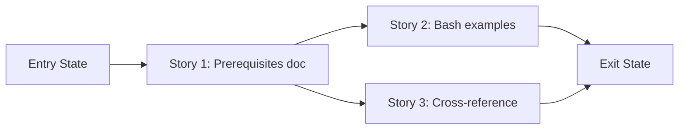

# Phase Contract: Phase 2 - Complete Linux Deployment Documentation

**Date**: 2026-04-04
**Feature**: ids-linux-packaging-and-instructions
**Phase Plan Reference**: `history/ids-linux-packaging-and-instructions/phase-plan.md`
**Based on**:
- `history/ids-linux-packaging-and-instructions/CONTEXT.md`
- `history/ids-linux-packaging-and-instructions/discovery.md`
- `history/ids-linux-packaging-and-instructions/approach.md`

---

## 1. What This Phase Changes

After this phase, an operator starting from a fresh Ubuntu/Debian host can follow documentation from "install system packages" through "verify the stack is running" without hitting any undocumented steps. The e2e demo runbook works on both Windows and Linux. The root README shows bash commands alongside PowerShell.

---

## 2. Why This Phase Exists Now

- Phase 1 finalized the release artifact and installer — documentation now describes the final tooling behavior, not a moving target.
- The biggest gap for a real Linux deployment is knowing what to `apt install` before running the installer. Without this, operators guess.

---

## 3. Entry State

- Phase 1 complete: `.gitattributes` with export-ignore, installer has Python version check
- Release tarball is trimmed (329 files vs 771)
- Existing ops docs (`deployment_quickstart.md`, `ids_same_host_stack_operations.md`, `ops/README-deploy.md`) already use bash
- `e2e_demo_runbook.md` uses PowerShell only
- Root `README.md` uses PowerShell only
- No Linux prerequisites doc exists

---

## 4. Exit State

- `docs/current/operations/linux_prerequisites.md` exists with:
  - Required system packages (Python 3.11+, dumpcap, CICFlowMeter, bash, systemd, coreutils)
  - Optional packages (nginx, certbot)
  - `apt install` commands for Ubuntu/Debian
  - Verification commands for each dependency
- `docs/current/operations/e2e_demo_runbook.md` includes bash command blocks for all demos
- `README.md` includes a bash quick-test command alongside PowerShell
- `docs/current/operations/README.md` links to the new prerequisites doc
- All documentation forms a complete reading path from prerequisites → install → bootstrap → verify

---

## 5. Demo Walkthrough

Open `docs/current/operations/linux_prerequisites.md`. Read through the system package list and `apt install` commands. Then follow the link to `deployment_quickstart.md`. The reading path should be unbroken: prerequisites → extract tarball → install → bootstrap → preflight → smoke.

### Demo Checklist

- [ ] `linux_prerequisites.md` exists and lists all required system packages
- [ ] Each package has an install command and verification command
- [ ] `e2e_demo_runbook.md` has bash code blocks for all 6 demos
- [ ] `README.md` has bash quick-test command
- [ ] `docs/current/operations/README.md` links to prerequisites doc
- [ ] A reader can follow the docs from "fresh Ubuntu box" to "ids-stack preflight" without gaps

---

## 6. Story Sequence At A Glance

| Story | What Happens | Why Now | Unlocks Next | Done Looks Like |
|-------|--------------|---------|--------------|-----------------|
| Story 1: Linux prerequisites doc | New doc listing all system packages with install/verify commands | Most impactful gap — operators can't start without it | Stories 2 and 3 can reference it | `linux_prerequisites.md` exists with all required + optional packages |
| Story 2: Bash examples in operator docs | Demo runbook and README get bash command blocks | Operators on Linux can actually run the demos | Story 3 linking | `e2e_demo_runbook.md` has bash blocks; `README.md` has bash quick-test |
| Story 3: Cross-reference and link | Operations README links to prerequisites; reading path is complete | Depends on Story 1 existing | Feature complete | All ops docs link together; no dead ends |

---

## 7. Phase Diagram

---

## 8. Out Of Scope

- Converting ML/training docs (kaggle, hyperparameter tuning, dataset preprocessing) to bash — these are Windows dev workflows
- Docker/container packaging
- CI/CD pipeline setup
- Updating `ids_same_host_stack_operations.md` (already bash-only and complete)

---

## 9. Success Signals

- A reader unfamiliar with the project can follow the docs to understand what to install on a fresh Linux host
- No gaps in the reading path from prerequisites to verification
- Existing bash-only ops docs are not disrupted

---

## 10. Failure / Pivot Signals

- If CICFlowMeter has no standard Ubuntu package (it doesn't — it's custom) and requires complex build instructions, the prerequisites doc may need a separate section or external reference
- If the demo runbook commands don't work on Linux (path differences, missing tools), the bash blocks need testing
