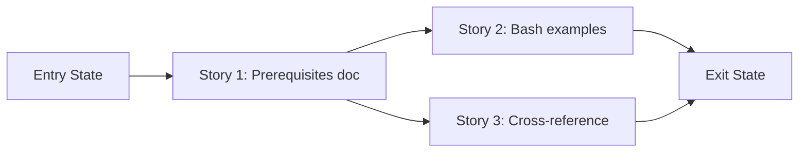

# Story Map: Phase 2 - Complete Linux Deployment Documentation

**Date**: 2026-04-04
**Phase Plan**: `history/ids-linux-packaging-and-instructions/phase-plan.md`
**Phase Contract**: `history/ids-linux-packaging-and-instructions/phase-2-contract.md`
**Approach Reference**: `history/ids-linux-packaging-and-instructions/approach.md`

---

## 1. Story Dependency Diagram

Story 1 must be done first (Stories 2 and 3 reference it). Stories 2 and 3 can run in parallel after that.

---

## 2. Story Table

| Story | What Happens | Why Now | Contributes To | Creates | Unlocks | Done Looks Like |
|-------|-------------|---------|----------------|---------|---------|-----------------|
| Story 1: Prerequisites doc | New doc with all system package requirements | Most critical gap | Exit state: prerequisites doc exists | `docs/current/operations/linux_prerequisites.md` | Stories 2, 3 | Doc lists all required/optional packages with apt commands |
| Story 2: Bash examples | Demo runbook and README get Linux-friendly commands | Operators need runnable commands | Exit state: docs have bash blocks | Modified `e2e_demo_runbook.md`, `README.md` | Exit state | Both files have bash code blocks |
| Story 3: Cross-reference | Ops README links to prerequisites; reading path complete | Needs Story 1 to exist | Exit state: complete reading path | Modified `docs/current/operations/README.md` | Feature complete | All ops docs link together |

---

## 3. Story Details

### Story 1: Linux Prerequisites Doc

- **What Happens**: A new `docs/current/operations/linux_prerequisites.md` is created listing every system package needed on a fresh Linux host before running the installer.
- **Why Now**: This is the most impactful documentation gap. Without it, operators don't know what to `apt install`.
- **Contributes To**: Exit state — prerequisites doc exists with all packages
- **Creates**: `docs/current/operations/linux_prerequisites.md`
- **Unlocks**: Stories 2 and 3 can reference this doc
- **Done Looks Like**: Doc exists with sections for required packages (Python 3.11+, dumpcap, CICFlowMeter, bash, systemd, coreutils), optional packages (nginx, certbot), install commands, and verification commands.
- **Candidate Bead Themes**:
  - Write the prerequisites doc

### Story 2: Bash Examples in Operator Docs

- **What Happens**: The e2e demo runbook gets bash command blocks alongside PowerShell. The root README gets a bash quick-test command.
- **Why Now**: Depends on Story 1 existing (for linking). These are the two user-facing docs that currently only have PowerShell.
- **Contributes To**: Exit state — operator docs have bash examples
- **Creates**: Modified `e2e_demo_runbook.md` and `README.md`
- **Unlocks**: Story 3 cross-referencing
- **Done Looks Like**: `e2e_demo_runbook.md` has bash code blocks for all demos. `README.md` has a bash quick-test command.
- **Candidate Bead Themes**:
  - Add bash examples to demo runbook
  - Add bash quick-test to README

### Story 3: Cross-Reference and Link

- **What Happens**: The operations README links to the new prerequisites doc. The reading path from prerequisites → quickstart → full ops guide is unbroken.
- **Why Now**: Needs Story 1 to exist so the link target is real.
- **Contributes To**: Exit state — complete reading path
- **Creates**: Modified `docs/current/operations/README.md`
- **Unlocks**: Feature complete
- **Done Looks Like**: Operations README has a bullet linking to `linux_prerequisites.md`. A reader can navigate from prerequisites through deployment without gaps.
- **Candidate Bead Themes**:
  - Add link to prerequisites in ops README

---

## 4. Story Order Check

- [x] Story 1 is obviously first — it creates the doc that Stories 2 and 3 reference
- [x] Stories 2 and 3 can run in parallel after Story 1
- [x] If every story reaches "Done Looks Like", the phase exit state is true

---

## 5. Story-To-Bead Mapping

| Story | Beads | Notes |
|-------|-------|-------|
| Story 1: Prerequisites doc | `ids_ml_new-ptz2.4` | New file creation |
| Story 2: Bash examples | `ids_ml_new-ptz2.5` | Modify 2 files; blocked by ptz2.4 |
| Story 3: Cross-reference | `ids_ml_new-ptz2.6` | Modify 1 file; blocked by ptz2.4 |
