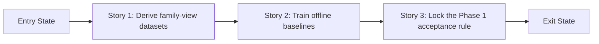

# Phase Contract: Phase 1 - Prove Family Classification Offline

**Date**: 2026-04-04
**Feature**: `ids-multiclass-two-stage-classification`
**Phase Plan Reference**: `history/ids-multiclass-two-stage-classification/phase-plan.md`
**Based on**:
- `history/ids-multiclass-two-stage-classification/CONTEXT.md`
- `history/ids-multiclass-two-stage-classification/discovery.md`
- `history/ids-multiclass-two-stage-classification/approach.md`

---

## 1. What This Phase Changes

This phase does not change the live IDS yet. It makes the repo capable of deriving family-focused views from the frozen binary dataset, training the first offline family-classification baselines, and proving whether `unknown` handling is believable enough to justify touching the production runtime later. After this phase lands, the team should be able to point to concrete reports instead of opinions when deciding how the stage-2 family classifier should behave.

---

## 2. Why This Phase Exists Now

- This phase is first because the whole multiclass direction depends on whether the existing processed dataset can support a useful family classifier with `unknown` behavior.
- If this phase were skipped, Phase 2 would be forced to guess at family targets, abstention rules, and bundle shape without hard evidence from the actual data.

---

## 3. Entry State

- The repo already has a frozen binary dataset artifact at `artifacts/cic_iot_diad_2024_binary`.
- The binary runtime and promoted model bundle are working and remain the only live contract.
- `CONTEXT.md`, `discovery.md`, `approach.md`, and `phase-plan.md` already lock the two-stage direction and the Phase 1 objective.

---

## 4. Exit State

- The repo can deterministically derive new family-view artifacts from the frozen binary parquet files without mutating the canonical binary artifact in place.
- The repo can run offline evaluation for the family lane both as an oracle classifier on attack rows and as a stage-1-gated two-stage pipeline, and can compare that evidence against a direct multiclass baseline.
- A written acceptance rule exists for what counts as `known family` versus `unknown family`, backed by concrete metrics from in-distribution test data and the `ood_attack_holdout`.

**Rule:** every exit-state line must be testable or demonstrable.

---

## 5. Demo Walkthrough

The system can now take the existing frozen binary dataset, derive an attack-family training/evaluation view from it, train the offline family and direct-multiclass baselines, run a gated replay that shows what happens after the current binary detector filters rows, and produce reports that tell a human whether the two-stage family design is strong enough to continue. A reviewer can run the data-derivation command, then run the offline family and direct-multiclass commands, then run the gated two-stage evaluation, and inspect one comparison output that shows oracle family metrics, gated pipeline behavior, OOD unknown behavior, and the proposed acceptance thresholds for later runtime work.

### Demo Checklist

- [ ] Run the family-view derivation command against `artifacts/cic_iot_diad_2024_binary`
- [ ] Run the stage-2 family classifier evaluation and the direct multiclass baseline evaluation
- [ ] Run the gated two-stage evaluation using the current stage-1 detector plus the offline family classifier outputs
- [ ] Read one consolidated output that states the recommended `unknown` rule and whether Phase 2 should proceed

---

## 6. Story Sequence At A Glance

| Story | What Happens | Why Now | Unlocks Next | Done Looks Like |
|-------|--------------|---------|--------------|-----------------|
| Story 1: Derive family-view datasets | The repo can materialize attack-only and direct-multiclass views plus manifests from the frozen artifact. | This has to happen first because every offline model and report depends on a reproducible data source. | Offline model training and comparison | A repeatable derivation command writes new family-view artifacts and reports without modifying the frozen binary source artifact. |
| Story 2: Train and evaluate offline baselines | The repo can train the first family classifier, compare it to a direct multiclass baseline, and show what the family lane looks like after stage-1 gating. | This comes next because acceptance rules are meaningless until the candidate models have produced evidence in both oracle and gated form. | Acceptance-rule design for `unknown` and later bundle work | Offline reports show oracle family quality, gated two-stage behavior, and comparison between the two-stage family lane and the direct multiclass baseline. |
| Story 3: Lock the Phase 1 acceptance rule | The repo translates the offline evidence into one practical rule for `known` versus `unknown` and one clear go/no-go summary for Phase 2. | This closes the phase because later runtime work needs a concrete evaluation target, not just raw metrics. | Phase 2 bundle/runtime preparation | One summary artifact states the recommended `unknown` behavior, the required acceptance metrics, and the remaining open risks for validating to spike. |

---

## 7. Phase Diagram

---

## 8. Out Of Scope

- No production runtime or bundle activation changes in this phase.
- No operator console or alert schema/UI rollout in this phase.
- No scenario-level classifier and no attempt to bring `BruteForce` or `Recon` into the initial supervised closed set.

---

## 9. Success Signals

- A fresh reviewer can run the offline Phase 1 workflow end to end and regenerate the same dataset views and report structure.
- The resulting reports make the next conversation concrete: whether the family classifier is good enough, what `unknown` should mean, and what validating must spike before Phase 2.

---

## 10. Failure / Pivot Signals

- The derived family-view artifact cannot be made reproducible from the frozen binary dataset without re-opening raw preprocessing design.
- The family classifier cannot achieve a believable tradeoff between known-family quality and OOD unknown handling on the current processed data.
- The direct multiclass baseline clearly invalidates the two-stage plan by being simpler and materially stronger, forcing a rethink of the larger approach before Phase 2.
