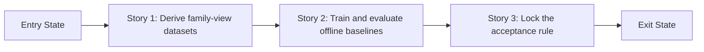

# Story Map: Phase 1 - Prove Family Classification Offline

**Date**: 2026-04-04
**Phase Plan**: `history/ids-multiclass-two-stage-classification/phase-plan.md`
**Phase Contract**: `history/ids-multiclass-two-stage-classification/phase-1-contract.md`
**Approach Reference**: `history/ids-multiclass-two-stage-classification/approach.md`

---

## 1. Story Dependency Diagram

---

## 2. Story Table

| Story | What Happens In This Story | Why Now | Contributes To | Creates | Unlocks | Done Looks Like |
|-------|-----------------------------|---------|----------------|---------|---------|-----------------|
| Story 1: Derive family-view datasets | The repo gains reproducible attack-only and direct-multiclass data views derived from the frozen binary parquet artifact. | This is obviously first because all later model evidence depends on a stable data source. | Exit state 1: deterministic derived family-view artifacts | New derived parquet/manifests/reports and the command that builds them | Story 2 | A reviewer can regenerate the same family-view artifact without touching `artifacts/cic_iot_diad_2024_binary`. |
| Story 2: Train and evaluate offline baselines | The repo trains and evaluates the stage-2 family classifier, compares it to the direct multiclass baseline, and measures the family lane after stage-1 gating. | This belongs next because acceptance rules need real model evidence, not intuition. | Exit state 2: oracle and gated offline model evaluation exists for the family lane, plus the direct multiclass comparison | Training scripts, evaluation outputs, gated replay outputs, and comparison reports | Story 3 | Reports show oracle family confusion, gated two-stage behavior, and a side-by-side comparison of the two candidate directions. |
| Story 3: Lock the acceptance rule | The repo turns the offline evidence into one explicit rule for `known` versus `unknown` and one clear Phase 1 summary for the next gate. | This closes the phase because Phase 2 should not start from raw metrics alone. | Exit state 3: acceptance rule backed by concrete evidence | Summary/decision artifact for validating and later runtime work | Phase 2 | One artifact states the recommended `unknown` rule, acceptance targets, and open spike questions. |

---

## 3. Story Details

### Story 1: Derive family-view datasets

- **What Happens In This Story**: the repo can derive attack-only and direct-multiclass dataset views, along with manifests and count summaries, from the already frozen binary parquet files.
- **Why Now**: every later training and comparison task needs a reproducible shared source; otherwise later metrics would not be comparable.
- **Contributes To**: `The repo can deterministically derive new family-view artifacts from the frozen binary parquet files without mutating the canonical binary artifact in place.`
- **Creates**: a derivation script, derived artifact directory, and supporting reports/manifests.
- **Unlocks**: the first credible family-model and direct-multiclass experiments.
- **Done Looks Like**: a fresh run produces the family-view artifact and its manifests from the frozen binary source without requiring raw CSV preprocessing.
- **Candidate Bead Themes**:
  - Implement the derivation command and artifact layout
  - Add deterministic count/manifests verification for the derived views

### Story 2: Train and evaluate offline baselines

- **What Happens In This Story**: the repo can train and evaluate both the stage-2 family classifier and the direct multiclass baseline against the same derived data source, and it can replay the family lane after the current stage-1 detector gates the rows.
- **Why Now**: it belongs here because the phase needs real offline evidence before anyone can sensibly choose thresholds or unknown-handling behavior.
- **Contributes To**: `The repo can run offline evaluation for the family lane both as an oracle classifier on attack rows and as a stage-1-gated two-stage pipeline, and can compare that evidence against a direct multiclass baseline.`
- **Creates**: training scripts, oracle metrics outputs, gated replay outputs, and comparison-friendly reports for both candidate directions.
- **Unlocks**: a concrete decision about what `unknown family` should mean and whether Phase 2 should proceed.
- **Done Looks Like**: reports exist for oracle family evaluation, gated two-stage evaluation, and direct multiclass comparison, and all can be re-run from the same derived family-view artifact.
- **Candidate Bead Themes**:
  - Implement stage-2 family classifier training/evaluation
  - Implement direct multiclass comparison baseline and side-by-side report inputs
  - Implement stage-1-gated replay/evaluation for the family lane

### Story 3: Lock the acceptance rule

- **What Happens In This Story**: the repo converts the offline metrics into one explicit recommendation for `known family` versus `unknown family`, plus the acceptance targets that validating should treat as the Phase 1 exit proof.
- **Why Now**: this is last because it only makes sense after both offline baselines have produced evidence.
- **Contributes To**: `A written acceptance rule exists for what counts as known family versus unknown family, backed by concrete metrics from in-distribution test data and the ood_attack_holdout.`
- **Creates**: a Phase 1 summary artifact that names the recommended abstention rule, acceptance metrics, and remaining spike questions.
- **Unlocks**: Phase 2 contract and validating spikes for the highest-risk design choices.
- **Done Looks Like**: a reviewer can read one summary artifact and understand whether the two-stage direction should proceed and what validating must prove next.
- **Candidate Bead Themes**:
  - Write the acceptance-rule summary from the completed offline reports
  - Capture the exact validation questions that remain HIGH-risk

---

## 4. Story Order Check

- [x] Story 1 is obviously first
- [x] Every later story builds on or de-risks an earlier story
- [x] If every story reaches "Done Looks Like", the phase exit state should be true

---

## 5. Story-To-Bead Mapping

> Fill this in after bead creation so validating and swarming can see how the narrative maps to executable work.

| Story | Beads | Notes |
|-------|-------|-------|
| Story 1: Derive family-view datasets | `ids_ml_new-3rc7.1` | Deterministic source for the whole phase |
| Story 2: Train offline baselines | `ids_ml_new-3rc7.4`, `ids_ml_new-3rc7.2`, `ids_ml_new-3rc7.5` | `ids_ml_new-3rc7.4` and `ids_ml_new-3rc7.2` can run after Story 1; `ids_ml_new-3rc7.5` waits for `ids_ml_new-3rc7.4` because it consumes the family-classifier outputs to provide the D9 proof surface |
| Story 3: Lock the acceptance rule | `ids_ml_new-3rc7.3` | Depends on all Story 2 evidence beads finishing |
