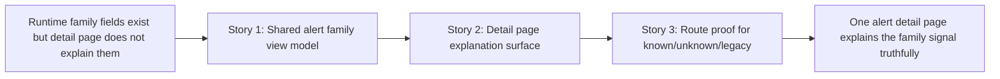

# Phase Contract: Phase 1 - Make One Alert Explain The Family Signal

**Date**: 2026-04-05
**Feature**: `ids-multiclass-two-stage-operator-surfaces`
**Phase Plan Reference**: `history/ids-multiclass-two-stage-operator-surfaces/phase-plan.md`
**Based on**:
- `history/ids-multiclass-two-stage-operator-surfaces/CONTEXT.md`
- `history/ids-multiclass-two-stage-operator-surfaces/discovery.md`
- `history/ids-multiclass-two-stage-operator-surfaces/approach.md`

---

## 1. What This Phase Changes

This phase makes one clicked-through alert trustworthy. After it lands, an operator opening `/alerts/{id}` can tell whether the runtime assigned a known family, abstained to `unknown`, or simply lacks family enrichment because the alert is older than the rollout. The point is not to add more workflow yet; the point is to make the family signal understandable enough that later queue shorthand will not mislead people.

---

## 2. Why This Phase Exists Now

- This phase is first because the detail page is the safest place to explain a new model signal before it appears at queue speed.
- If this phase were skipped, Phase 2 would force operators to read compact queue labels like `unknown` without a trustworthy explanation surface behind them.

---

## 3. Entry State

- The runtime already emits additive family enrichment fields: `attack_family`, `attack_family_confidence`, `attack_family_margin`, and `family_status`.
- The operator store already persists alert events, but family metadata only survives indirectly through `payload_json`; there are no first-class family columns.
- The current alert detail page shows network and triage context only; it does not yet explain family semantics or distinguish legacy/unavailable family state.
- Existing route tests cover alert queue/detail auth and triage basics, but they do not yet pin known/unknown/legacy family rendering.

---

## 4. Exit State

- A canonical alert-family view model exists for operator alert rows so the detail page can read family fields and fallback states without decoding or interpreting raw payloads on its own.
- The alert detail page renders family semantics truthfully for enriched known-family alerts, enriched unknown-family alerts, and legacy alerts with no family enrichment.
- Route-level regression tests prove those detail states through the real `/alerts/{id}` surface.

**Rule:** every exit-state line must be testable or demonstrable.

---

## 5. Demo Walkthrough

Seed or replay three alerts into the operator console store: one enriched alert with `family_status="known"`, one enriched alert with `family_status="unknown"`, and one legacy alert with no family fields at all. Open each alert detail page. The operator should be able to tell what the system believes in each case without opening raw JSON, and should never confuse an older alert with a confident family conclusion.

### Demo Checklist

- [ ] One enriched known-family alert renders family label plus support context on `/alerts/{id}`.
- [ ] One enriched unknown-family alert renders explicit `unknown` meaning instead of a blank family field.
- [ ] One legacy alert renders an explicit unavailable/legacy state rather than pretending a family result exists.

---

## 6. Story Sequence At A Glance

| Story | What Happens | Why Now | Unlocks Next | Done Looks Like |
|-------|--------------|---------|--------------|-----------------|
| Story 1: Shape one canonical family view model for alerts | The console gains one shared way to interpret persisted family metadata and legacy fallback states. | This has to be first because every later visible surface depends on the same meaning. | Story 2 can render the detail page without inventing its own payload logic. | One helper produces stable family keys and fallback state for alert rows. |
| Story 2: Teach the detail page to explain the signal | The alert detail page shows family label, status, support context, and honest legacy fallback. | Once the shared semantics exist, one alert can become trustworthy for real operators. | Story 3 can freeze the rendered contract with route tests. | An operator can open one alert and understand `known`, `unknown`, and unavailable family states. |
| Story 3: Prove one-alert semantics with route tests | The real `/alerts/{id}` route is pinned against known/unknown/legacy rendering regressions. | The explanation surface only becomes durable once tests prove the visible contract. | Phase 2 can safely bring the same meaning into the queue. | Route tests fail if the detail page silently drops or misstates family semantics. |

---

## 7. Phase Diagram

---

## 8. Out Of Scope

- Compact family/status presentation in the `/alerts` queue.
- Reports, analytics, or family rollups.
- Family-based suppression rules, triage states, notifications, or automation.
- SQLite schema redesign for first-class family columns unless validating later proves the payload-based view model is insufficient.

---

## 9. Success Signals

- A human reviewer can inspect one enriched alert and one legacy alert and immediately understand what the system is claiming in each case.
- The family interpretation logic lives in one shared helper instead of being duplicated across routes and templates.
- Route tests exercise the real alert detail surface and fail if `unknown` or legacy/unavailable behavior regresses.

---

## 10. Failure / Pivot Signals

- If the persisted alert payloads do not reliably carry the runtime family fields into the operator store, this phase must stop and rethink whether payload-based shaping is enough.
- If the detail page only works by decoding or interpreting raw payloads inside the template, the phase is drifting into duplicated semantics and should pivot back to a shared helper.
- If legacy alerts cannot be distinguished from enriched alerts cleanly, Phase 2 should not proceed because queue shorthand would mislead operators.
