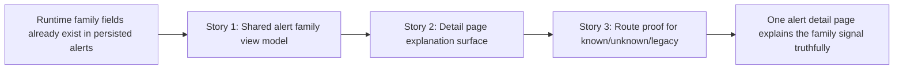

# Story Map: Phase 1 - Make One Alert Explain The Family Signal

**Date**: 2026-04-05
**Phase Plan**: `history/ids-multiclass-two-stage-operator-surfaces/phase-plan.md`
**Phase Contract**: `history/ids-multiclass-two-stage-operator-surfaces/phase-1-contract.md`
**Approach Reference**: `history/ids-multiclass-two-stage-operator-surfaces/approach.md`

---

## 1. Story Dependency Diagram

---

## 2. Story Table

| Story | What Happens In This Story | Why Now | Contributes To | Creates | Unlocks | Done Looks Like |
|-------|-----------------------------|---------|----------------|---------|---------|-----------------|
| Story 1: Shape one canonical family view model for alerts | The console gains one shared way to read family metadata and explicit fallback states from persisted alert payloads. | Every later visible surface depends on the same meaning, so the shared helper must come first. | Exit-state line 1 | Canonical alert-family row keys and fallback semantics | Story 2 | Queue/detail consumers can read the same family keys without their own payload logic. |
| Story 2: Teach the detail page to explain the signal | The alert detail page shows family label, family status, support context, and honest legacy fallback. | Once the shared helper exists, one alert can become a trustworthy explanation surface. | Exit-state line 2 | A rendered detail-page family block using the shared view model | Story 3 | One clicked-through alert explains `known`, `unknown`, and unavailable states cleanly. |
| Story 3: Prove one-alert semantics with route tests | Route tests pin the visible detail-page contract for enriched and legacy alerts. | The new explanation surface only becomes durable once the real route is tested against the visible states. | Exit-state line 3 | Known/unknown/legacy route regression coverage | Phase 2 | The detail route fails loudly if family semantics drift or disappear. |

---

## 3. Story Details

### Story 1: Shape one canonical family view model for alerts

- **What Happens In This Story**: alert hydration grows one shared set of family keys and fallback rules so the operator UI can consume family semantics without reaching into raw payloads directly.
- **Why Now**: if this helper is not settled first, the detail page will invent its own interpretation and Phase 2 queue work will drift immediately afterward.
- **Contributes To**: `A canonical alert-family view model exists for operator alert rows so the detail page can read family fields and fallback states without decoding or interpreting raw payloads on its own.`
- **Creates**: canonical family keys, explicit legacy/unavailable fallback behavior, and one stable boundary for later queue/detail use.
- **Unlocks**: Story 2 can render visible operator copy without duplicating runtime semantics.
- **Done Looks Like**: one hydrated alert row carries family data in a stable shape for enriched alerts and an explicit unavailable/legacy state for older alerts.
- **Candidate Bead Themes**:
  - extend `ids/console/alerts.py` with family-field shaping and fallback keys
  - pin any payload-carriage assumption needed by the shared helper

### Story 2: Teach the detail page to explain the signal

- **What Happens In This Story**: `/alerts/{id}` shows family label, family status, and enough support context that an operator understands the meaning of `known`, `unknown`, and unavailable.
- **Why Now**: the shared helper now exists, so this story can focus on operator understanding rather than data extraction.
- **Contributes To**: `The alert detail page renders family semantics truthfully for enriched known-family alerts, enriched unknown-family alerts, and legacy alerts with no family enrichment.`
- **Creates**: a trustworthy clicked-through explanation surface on the existing detail page.
- **Unlocks**: Story 3 can freeze that rendered behavior with route tests.
- **Done Looks Like**: an operator can open one enriched alert and one legacy alert and understand the difference without reading raw JSON.
- **Candidate Bead Themes**:
  - add a family explanation block to `alert_detail.html`
  - thread the shared family view model through the detail route

### Story 3: Prove one-alert semantics with route tests

- **What Happens In This Story**: route-level tests seed representative alert rows and assert the real detail page renders known, unknown, and legacy/unavailable states correctly.
- **Why Now**: once the detail page behavior exists, tests can lock it so later queue work builds on a durable contract.
- **Contributes To**: `Route-level regression tests prove those detail states through the real /alerts/{id} surface.`
- **Creates**: visible-contract regression coverage for the clicked-through family explanation surface.
- **Unlocks**: Phase 2 queue work can mirror the same meaning without guessing.
- **Done Looks Like**: the test suite fails if the detail page silently drops family semantics, mislabels `unknown`, or treats legacy rows as enriched.
- **Candidate Bead Themes**:
  - extend `tests/console/test_ids_operator_console_alerts_web.py` with known/unknown/legacy assertions
  - add supporting shared web-app assertions only if the route contract needs them

---

## 4. Story Order Check

- [x] Story 1 is obviously first
- [x] Every later story builds on or de-risks an earlier story
- [x] If every story reaches "Done Looks Like", the phase exit state should be true

---

## 5. Story-To-Bead Mapping

| Story | Beads | Notes |
|-------|-------|-------|
| Story 1: Shape one canonical family view model for alerts | `ids_ml_new-3rc7.6` | owns the shared family-shaping helper and fallback contract; blocks all later Phase 1 work |
| Story 2: Teach the detail page to explain the signal | `ids_ml_new-3rc7.7` | depends on `ids_ml_new-3rc7.6`; owns the visible detail-page explanation surface |
| Story 3: Prove one-alert semantics with route tests | `ids_ml_new-3rc7.8` | depends on `ids_ml_new-3rc7.7`; closes the phase by pinning the visible contract through the real route |
