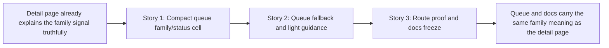

# Phase Contract: Phase 2 - Bring The Same Meaning Into The Triage Queue And Docs

**Date**: 2026-04-05
**Feature**: `ids-multiclass-two-stage-operator-surfaces`
**Phase Plan Reference**: `history/ids-multiclass-two-stage-operator-surfaces/phase-plan.md`
**Based on**:
- `history/ids-multiclass-two-stage-operator-surfaces/CONTEXT.md`
- `history/ids-multiclass-two-stage-operator-surfaces/discovery.md`
- `history/ids-multiclass-two-stage-operator-surfaces/approach.md`

---

## 1. What This Phase Changes

This phase makes the family signal usable at queue speed without changing what it means. After it lands, an operator scanning `/alerts` can tell whether an attack row has a known family, an explicit `unknown` family outcome, or no family enrichment because the alert is legacy. The queue stays triage-first, and the docs/tests freeze the same meaning so later work cannot quietly reinterpret `unknown`, benign, or legacy/unavailable states.

---

## 2. Why This Phase Exists Now

- Phase 1 already made one alert detail page trustworthy, so the next practical value is seeing the same meaning in the queue before opening each alert.
- This phase is separate because queue shorthand is only safe now that operators can click through to a detail page that explains the signal fully.
- The remaining risk is semantic drift between the helper, queue template, tests, and docs. This phase exists to propagate the Phase 1 meaning cleanly and freeze it.

---

## 3. Entry State

- `ids/console/alerts.py` already exposes a canonical `family` view model with `known`, `unknown`, `benign`, and `legacy_unavailable` states.
- `/alerts/{alert_id}` already renders the family signal truthfully on the detail page, and route tests pin known, unknown, benign, and legacy behavior there.
- `/alerts` still renders a compact triage table with severity, IPs, protocol, status, and time only; it does not surface family meaning yet.
- `docs/current/console/ids_operator_console_ui_surface_spec.md` still describes the alerts queue and alert-row contract without any family-specific queue semantics.

---

## 4. Exit State

- The `/alerts` queue renders one compact family/status presentation that reuses the existing family view semantics instead of inventing a second interpretation path.
- Queue copy handles `unknown` and legacy/unavailable states honestly at a glance, while benign rows still do not show an attack-family label.
- Route-level tests and docs/spec updates pin the queue/detail contract together so future work cannot silently redefine family meaning on operator surfaces.

**Rule:** every exit-state line must be testable or demonstrable.

### Queue State Matrix

The final `Family Signal` queue cell must mean the following:

| Family state | Queue cell result |
|--------------|-------------------|
| `known` | first line shows a compact `known family` state marker; second line shows the known family label |
| `unknown` | first line shows an explicit `unknown family` state marker; second line says this is still an attack but no confident family was assigned |
| `legacy_unavailable` | first line shows `family unavailable`; second line identifies the row as a legacy alert rather than a confident family result |
| `benign` | no family badge or family label; the cell stays neutral (`—`) rather than claiming a family outcome |

Story ownership inside this phase is also fixed:

- Story 1 owns the new `Family Signal` column/cell structure and the final `known` presentation.
- Story 2 owns the final wording for `unknown` and `legacy_unavailable`, and it locks benign to the neutral no-family state.

---

## 5. Demo Walkthrough

Seed or replay a mixed queue with four representative alerts: one enriched `known` attack, one enriched `unknown` attack, one benign alert, and one legacy alert without family enrichment. Open `/alerts` and confirm the row-level family signal is compact but truthful: known family rows show the family label, unknown rows show an explicit unknown attack state, legacy rows show family unavailable/legacy, and benign rows do not claim a family label. Click from the queue into one detail page and confirm the deeper explanation matches the queue meaning exactly. Then read the updated UI surface spec and tests to verify that the same contract is now written down and enforced.

### Demo Checklist

- [ ] `/alerts` shows a compact known-family queue signal without expanding the triage workflow.
- [ ] `/alerts` shows explicit unknown-family and legacy/unavailable states without implying benign or runtime failure.
- [ ] Benign rows do not gain an attack-family label in the queue.
- [ ] Queue semantics match the clicked-through detail page and the updated surface spec.

---

## 6. Story Sequence At A Glance

| Story | What Happens | Why Now | Unlocks Next | Done Looks Like |
|-------|--------------|---------|--------------|-----------------|
| Story 1: Add compact family/status presentation to queue rows | The queue gains one compact family cell that mirrors the shared family view model. | The shared semantics already exist, so the queue can now consume them without inventing its own meaning. | Story 2 can refine queue fallback and guidance on top of real row rendering. | Known-family rows surface their family label compactly, and the queue stays triage-first. |
| Story 2: Handle queue-level fallback and light guidance | Unknown and legacy/unavailable states become readable at a glance, while benign rows stay family-free. | Once the row cell exists, the queue needs just enough guidance to prevent misreading under triage pressure. | Story 3 can freeze the exact operator contract in tests and docs. | Operators can scan the queue without confusing `unknown`, legacy, and benign states. |
| Story 3: Freeze the operator contract in tests and docs | Tests and the surface spec lock the queue/detail meaning together. | The queue contract only becomes durable once the visible behavior is pinned in regression proof and docs. | Review and ship. | Future changes fail loudly if queue/docs drift away from the locked semantics. |

---

## 7. Phase Diagram

---

## 8. Out Of Scope

- Runtime, model, bundle, or ingest-lane changes.
- Reports, analytics, family rollups, queue filtering, sorting, or automation.
- New routes, new pages, or queue workflow redesign outside the existing `/alerts` table.
- Reopening Phase 1 detail-surface work unless a concrete queue/docs contradiction is discovered.

---

## 9. Success Signals

- A human reviewer can scan the queue and distinguish known family, unknown attack, legacy/unavailable, and benign-with-no-family-label without opening raw payloads.
- The queue consumes the existing shared family helper rather than adding new interpretation logic in the template.
- Tests and the console UI surface spec now describe the same operator-visible family contract.

---

## 10. Failure / Pivot Signals

- If the queue can only show the family signal by duplicating semantic logic in `alerts.html`, this phase is drifting away from the shared helper and must pivot back.
- If the queue layout requires new filters, dashboards, or family-heavy workflow to make the signal readable, the phase is expanding past locked decision `D2` and must stop.
- If benign rows cannot stay family-free while still keeping known/unknown/legacy readable, the row contract is still muddy and should not be frozen in docs/tests yet.
