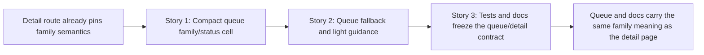

# Story Map: Phase 2 - Bring The Same Meaning Into The Triage Queue And Docs

**Date**: 2026-04-05
**Phase Plan**: `history/ids-multiclass-two-stage-operator-surfaces/phase-plan.md`
**Phase Contract**: `history/ids-multiclass-two-stage-operator-surfaces/phase-2-contract.md`
**Approach Reference**: `history/ids-multiclass-two-stage-operator-surfaces/approach.md`

---

## 1. Story Dependency Diagram

---

## 2. Story Table

| Story | What Happens In This Story | Why Now | Contributes To | Creates | Unlocks | Done Looks Like |
|-------|-----------------------------|---------|----------------|---------|---------|-----------------|
| Story 1: Add compact family/status presentation to queue rows | The alerts table gains one compact family/status presentation that reads from the shared family helper. | The semantic source of truth already exists, so the queue can now mirror it safely. | Exit-state line 1 | Queue row rendering for family state on `/alerts` | Story 2 | Known-family rows show compact family context without turning the queue into a report. |
| Story 2: Handle queue-level fallback and light guidance | The queue makes unknown and legacy/unavailable states readable at a glance while keeping benign rows family-free. | After the family cell exists, the remaining risk is operator misreading under time pressure. | Exit-state line 2 | Queue copy, fallback text, and minimal guidance that explains `unknown` and legacy honestly | Story 3 | The queue can be scanned quickly without suggesting false family certainty or treating legacy as failure. |
| Story 3: Freeze the operator contract in tests and docs | Queue/detail parity becomes durable through route tests and spec updates. | Once the queue meaning is visible, it needs lasting proof and written contract coverage. | Exit-state line 3 | Queue-focused regression tests and updated UI surface spec | Review and ship | Future work fails loudly if queue/docs drift away from the locked family semantics. |

---

## 3. Story Details

### Story 1: Add compact family/status presentation to queue rows

- **What Happens In This Story**: `/alerts` renders one compact family/status cell or column that consumes the existing `family` view model already attached to each alert row.
- **Why Now**: the shared helper and detail-page explanation already exist, so this story can focus on triage presentation instead of semantic invention.
- **Contributes To**: `The /alerts queue renders one compact family/status presentation that reuses the existing family view semantics instead of inventing a second interpretation path.`
- **Creates**: queue-row rendering for known-family alerts and the structural hook that later fallback/guidance copy will refine.
- **Unlocks**: Story 2 can make queue-level `unknown` and legacy behavior readable without first building the entire family row surface.
- **Done Looks Like**: a mixed queue shows compact family context for attack rows while staying visually triage-first.
- **Boundary Lock**: this story owns the `Family Signal` column and the final `known` state rendering only. For `unknown`, `legacy_unavailable`, and `benign`, it may leave a neutral placeholder state, but it must not invent the final wording that Story 2 owns.
- **Candidate Bead Themes**:
  - extend `ids/console/templates/alerts.html` with a compact family/status presentation
  - keep queue rendering on top of `alert["family"]` / shared hydrated fields instead of raw payload reads

### Story 2: Handle queue-level fallback and light guidance

- **What Happens In This Story**: the queue adds honest fallback treatment and just enough copy to explain `unknown` and legacy/unavailable without creating a new workflow or dashboard.
- **Why Now**: once the queue renders the family signal structurally, this story reduces the risk of fast triage misreading.
- **Contributes To**: `Queue copy handles unknown and legacy/unavailable states honestly at a glance, while benign rows still do not show an attack-family label.`
- **Creates**: explicit queue-level unknown and legacy/unavailable labeling plus benign-safe behavior.
- **Unlocks**: Story 3 can freeze the final operator-facing meaning in tests and docs.
- **Done Looks Like**: an operator scanning `/alerts` can tell the difference between unknown attack, legacy/unavailable, and benign-with-no-family-label without guessing.
- **Boundary Lock**: this story does not redesign the queue column. It fills the Story 1 structure with the final `unknown` wording, the final `family unavailable` + `legacy` fallback, and the final benign neutral state (`—` with no family badge or label).
- **Candidate Bead Themes**:
  - add light queue guidance text or label copy in `alerts.html`
  - verify queue rendering does not leak a family label for benign rows

### Story 3: Freeze the operator contract in tests and docs

- **What Happens In This Story**: regression tests and the console UI surface spec describe the same family queue/detail meaning and fail if later work drifts.
- **Why Now**: after the queue behavior is visible and stable, the repo needs durable proof and written contract coverage.
- **Contributes To**: `Route-level tests and docs/spec updates pin the queue/detail contract together so future work cannot silently redefine family meaning on operator surfaces.`
- **Creates**: queue-focused route coverage and updated operator-surface documentation.
- **Unlocks**: final review and closure of the operator-surface phase.
- **Done Looks Like**: tests fail if the queue mislabels family states, and the docs tell a future worker the same meaning the UI now renders.
- **Candidate Bead Themes**:
  - extend `tests/console/test_ids_operator_console_alerts_web.py` and `tests/console/test_ids_operator_console_web.py` for queue/detail parity
  - update `docs/current/console/ids_operator_console_ui_surface_spec.md` with queue row semantics and alert-row family fields

---

## 4. Story Order Check

- [x] Story 1 is obviously first
- [x] Every later story builds on or de-risks an earlier story
- [x] If every story reaches "Done Looks Like", the phase exit state should be true

---

## 5. Story-To-Bead Mapping

| Story | Beads | Notes |
|-------|-------|-------|
| Story 1: Add compact family/status presentation to queue rows | `ids_ml_new-3rc7.10` | first queue rendering bead; blocks the rest of Phase 2 |
| Story 2: Handle queue-level fallback and light guidance | `ids_ml_new-3rc7.11` | depends on `ids_ml_new-3rc7.10` because the fallback/guidance copy sits on top of the queue presentation |
| Story 3: Freeze the operator contract in tests and docs | `ids_ml_new-3rc7.12` | depends on `ids_ml_new-3rc7.11` because docs/tests should freeze the final queue meaning, not an intermediate state |
