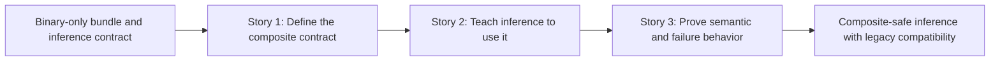

# Phase Contract: Phase 1 - Make One Composite Bundle Score Safely

**Date**: 2026-04-05
**Feature**: `ids-multiclass-two-stage-runtime-contract`
**Phase Plan Reference**: `history/ids-multiclass-two-stage-runtime-contract/phase-plan.md`
**Based on**:
- `history/ids-multiclass-two-stage-runtime-contract/CONTEXT.md`
- `history/ids-multiclass-two-stage-runtime-contract/discovery.md`
- `history/ids-multiclass-two-stage-runtime-contract/approach.md`

---

## 1. What This Phase Changes

This phase makes the feature real for the first time: one runtime inference path can read a composite production bundle, keep the existing binary contract, and add family enrichment fields with explicit `known`, `unknown`, and `benign` semantics. It also keeps the old binary bundle path alive so current environments do not need to migrate immediately. After this phase, the system can prove the new semantics in code and tests even before the live daemon, preflight, and promotion flows are updated.

---

## 2. Why This Phase Exists Now

- This phase is first because every later runtime, preflight, and lifecycle change depends on one stable composite contract.
- If this phase were skipped, later work would spread bundle-shape ambiguity across multiple operational surfaces and make failures harder to isolate.

---

## 3. Entry State

- Production bundle validation only understands the binary inference contract in `ids/core/model_bundle.py`.
- `ids.runtime.inference` and its tests only emit binary fields: `attack_score`, `predicted_label`, `is_alert`, and `threshold`.
- Legacy binary bundles and activation-based runtime resolution already work and are covered by tests.

---

## 4. Exit State

- A composite bundle fixture can be validated through the canonical bundle-loading path without reopening split runtime overrides.
- `ids.runtime.inference` can score with either a legacy binary bundle or a composite bundle; composite mode adds `attack_family`, `attack_family_confidence`, `attack_family_margin`, and `family_status` while legacy mode remains binary-only.
- Runtime inference tests explicitly prove the three semantic states `known`, `unknown`, and `benign`, plus fail-closed behavior when composite stage-2 scoring breaks.

**Rule:** every exit-state line must be testable or demonstrable.

---

## 5. Demo Walkthrough

The system can now load a composite bundle fixture, run the standard inference entrypoint on sample rows, and produce the same binary alert fields as before plus family enrichment when the family signal clears the bundled thresholds. A second run against a legacy binary bundle still returns the old binary-only shape, proving that rollout compatibility survives while the new contract becomes usable.

### Demo Checklist

- [ ] Validate a composite bundle fixture through the canonical manifest loader.
- [ ] Run runtime inference in composite mode and observe additive family enrichment fields with `known`, `unknown`, and `benign` semantics.
- [ ] Run runtime inference in legacy binary mode and confirm the old binary-only behavior still holds.

---

## 6. Story Sequence At A Glance

| Story | What Happens | Why Now | Unlocks Next | Done Looks Like |
|-------|--------------|---------|--------------|-----------------|
| Story 1: Define the composite contract | The codebase learns what a composite stage-1 + stage-2 production bundle looks like and how to validate it without breaking old bundles. | This has to exist before runtime can use it. | Runtime inference can resolve a real composite contract instead of a guessed one. | Manifest validation accepts valid composite fixtures, rejects broken ones, and still accepts legacy binary fixtures. |
| Story 2: Teach inference to use it | The runtime scoring path reads the composite contract, runs stage 2 when enabled, and appends family enrichment fields while keeping binary fields stable. | It depends on the contract shape from Story 1. | The phase can now express the intended runtime semantics. | Inference returns additive family fields in composite mode and unchanged binary output in legacy mode. |
| Story 3: Prove semantic and failure behavior | Tests pin `known`, `unknown`, `benign`, legacy compatibility, and fail-closed stage-2 error behavior. | This closes the phase by making the new contract believable instead of implicit. | Phase 2 can extend the daemon/lifecycle path with confidence that the core semantics are stable. | Regression coverage fails if the system silently falls back, breaks legacy mode, or confuses family states. |

---

## 7. Phase Diagram

---

## 8. Out Of Scope

- Realtime pipeline event propagation, live-sensor daemon wiring, preflight updates, and health/status visibility changes.
- Composite bundle packaging, promote/rollback hardening, and any console-family display or storage changes.

---

## 9. Success Signals

- Reviewers can point to one composite manifest shape and one inference output contract without ambiguity.
- The canonical inference path proves `known / unknown / benign` semantics in tests and does not break legacy binary bundle behavior.

---

## 10. Failure / Pivot Signals

- If the only workable design requires a second production config seam outside the activation contract, the phase should pivot and the larger plan should be reconsidered.
- If additive family fields cannot be introduced without breaking the current binary inference surface, the phase design is wrong.
- If legacy binary compatibility becomes too invasive or ambiguous under the chosen manifest shape, validating should force a rethink before Phase 2.
