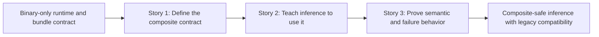

# Story Map: Phase 1 - Make One Composite Bundle Score Safely

**Date**: 2026-04-05
**Phase Plan**: `history/ids-multiclass-two-stage-runtime-contract/phase-plan.md`
**Phase Contract**: `history/ids-multiclass-two-stage-runtime-contract/phase-1-contract.md`
**Approach Reference**: `history/ids-multiclass-two-stage-runtime-contract/approach.md`

---

## 1. Story Dependency Diagram

---

## 2. Story Table

| Story | What Happens In This Story | Why Now | Contributes To | Creates | Unlocks | Done Looks Like |
|-------|-----------------------------|---------|----------------|---------|---------|-----------------|
| Story 1: Define the composite contract | One bundle manifest shape can describe stage 1, stage 2, and abstention thresholds while old binary bundles still load. | Runtime cannot consume a composite bundle until that contract exists. | Exit states 1 and 2 | A concrete composite manifest rule and composite test fixtures | Story 2 | Bundle validation accepts valid composite fixtures, rejects invalid ones, and still accepts legacy binary fixtures. |
| Story 2: Teach inference to use it | The canonical inference path resolves composite bundles and appends family enrichment fields without changing binary fields. | It depends on the composite shape from Story 1. | Exit states 2 and 3 | Two-stage runtime scoring behavior in `ids.runtime.inference` | Story 3 | Composite inference emits family enrichment plus stable binary fields; legacy inference stays binary-only. |
| Story 3: Prove semantic and failure behavior | The tests make the new runtime behavior explicit: `known`, `unknown`, `benign`, legacy compatibility, and fail-closed composite errors. | It closes the loop by turning the design into an executable contract. | Exit state 3 | Regression coverage and demo proof for the phase | Phase 2 | A regression suite catches silent fallback, wrong family semantics, and broken legacy compatibility. |

---

## 3. Story Details

### Story 1: Define the composite contract

- **What Happens In This Story**: the production bundle contract grows from binary-only to a composite shape that can describe stage 1, stage 2, and abstention thresholds while keeping the current activation model intact.
- **Why Now**: this is the first dependency for everything else in the phase.
- **Contributes To**: exit-state line 1 and makes exit-state line 2 possible.
- **Creates**: composite manifest schema, validation rules, and fixture examples for later runtime tests.
- **Unlocks**: runtime inference can safely branch on legacy vs composite bundles without guessing.
- **Done Looks Like**: code and tests agree on one valid composite manifest shape plus one preserved legacy-binary path.
- **Candidate Bead Themes**:
  - extend bundle manifest validation and fixture coverage
  - pin legacy/composite contract acceptance and rejection cases

### Story 2: Teach inference to use it

- **What Happens In This Story**: the runtime scoring path learns how to run stage 2 from the composite bundle and how to express `attack_family`, confidence, margin, and `family_status` while preserving binary fields.
- **Why Now**: there is no safe inference work until Story 1 defines the contract.
- **Contributes To**: exit-state line 2.
- **Creates**: composite-aware runtime config and two-stage inference behavior.
- **Unlocks**: the phase can now express real runtime semantics instead of just bundle metadata.
- **Done Looks Like**: composite inference returns additive family enrichment, and legacy inference still returns the old binary shape.
- **Candidate Bead Themes**:
  - extend `IDSModelConfig` / `IDSInferencer` for composite mode
  - keep CLI/output backward compatible while adding family enrichment

### Story 3: Prove semantic and failure behavior

- **What Happens In This Story**: tests make the composite semantics executable and catch the failure modes that would make later daemon work unsafe.
- **Why Now**: this story depends on the actual runtime behavior from Story 2.
- **Contributes To**: exit-state line 3.
- **Creates**: proof for `known`, `unknown`, `benign`, stage-2 failure handling, and legacy compatibility.
- **Unlocks**: Phase 2 can extend realtime/preflight/lifecycle surfaces with a stable core contract.
- **Done Looks Like**: the phase has direct regression tests that fail if runtime silently degrades, mislabels `benign` as `unknown`, or breaks legacy-binary behavior.
- **Candidate Bead Themes**:
  - add semantic-state regressions in runtime inference tests
  - add fail-closed stage-2 failure coverage and wrapper-smoke preservation

---

## 4. Story Order Check

> If a human reads only this file, the first question they should not need to ask is "why is Story 1 first?"

- [x] Story 1 is obviously first
- [x] Every later story builds on or de-risks an earlier story
- [x] If every story reaches "Done Looks Like", the phase exit state should be true

---

## 5. Story-To-Bead Mapping

> Fill this in after bead creation so validating and swarming can see how the narrative maps to executable work.

| Story | Beads | Notes |
|-------|-------|-------|
| Story 1: Define the composite contract | `ids_ml_new-d90e.1` | owns the composite manifest rule and legacy/composite validation seam |
| Story 2: Teach inference to use it | `ids_ml_new-d90e.2` | depends on `ids_ml_new-d90e.1`; owns the composite-aware scoring path |
| Story 3: Prove semantic and failure behavior | `ids_ml_new-d90e.3` | depends on `ids_ml_new-d90e.2`; uses a dedicated semantic-proof test surface to avoid contract/file overlap |

---

## 6. Spike Constraints Incorporated During Validating

- `ids_ml_new-86cd` confirmed that the safest composite design keeps `active_bundle.json` as a pointer to one bundle root and absorbs stage-2 metadata inside the canonical bundle manifest loader rather than adding a second production config seam.
- `ids_ml_new-86cd` also confirmed that malformed composite metadata must still fail at the `ModelBundleContractError` boundary so promotion and activation preserve the existing fail-closed behavior.
- `ids_ml_new-cr8u` confirmed that `ids.runtime.inference` has one credible additive seam: composite mode may append family enrichment fields, but must preserve the existing binary fields and their semantics exactly.
- `ids_ml_new-cr8u` also confirmed that once composite mode is active, stage-2 runtime errors must propagate as request/batch failures; silent binary-only fallback is not allowed.
