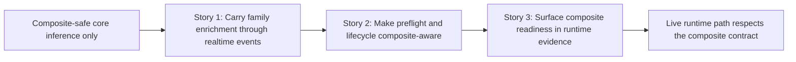

# Phase Contract: Phase 2 - Make The Live Runtime Respect That Contract

**Date**: 2026-04-05
**Feature**: `ids-multiclass-two-stage-runtime-contract`
**Phase Plan Reference**: `history/ids-multiclass-two-stage-runtime-contract/phase-plan.md`
**Based on**:
- `history/ids-multiclass-two-stage-runtime-contract/CONTEXT.md`
- `history/ids-multiclass-two-stage-runtime-contract/discovery.md`
- `history/ids-multiclass-two-stage-runtime-contract/approach.md`

---

## 1. What This Phase Changes

This phase takes the composite contract out of the lab-only inference path and makes the real runtime surfaces honor it. After this phase, the realtime JSONL pipeline, preflight checks, activation lifecycle commands, and health/runtime evidence all agree about whether a composite bundle is valid, active, and ready. The system should now behave the same way in the supervised runtime path as it already does in batch inference.

---

## 2. Why This Phase Exists Now

- Phase 1 proved one scoring seam and one composite manifest shape.
- The next practical question is whether the actual daemon-adjacent runtime path can carry that same contract without silent drift.
- If this phase were skipped, later packaging and rollout work would harden an artifact that only works in standalone inference, not in the real operational surfaces.

---

## 3. Entry State

- `ids.runtime.inference` can now score legacy and composite bundles safely.
- The realtime pipeline still emits the old binary-only event payload.
- Preflight, bundle lifecycle status, and health/runtime evidence still reflect only the binary-era contract.
- Composite bundle support is therefore real in core scoring, but not yet real in the live runtime path.

---

## 4. Exit State

- `ids.runtime.realtime_pipeline` carries the composite family enrichment fields through emitted events while preserving the existing binary fields.
- `ids.ops.live_sensor_preflight` and the bundle lifecycle/status path treat composite bundles as the production truth and fail closed on invalid composite candidates.
- Health/runtime evidence surfaces can show that the active bundle is composite-capable and ready, instead of looking like a binary-only runtime even when the enriched contract is active.

**Rule:** every exit-state line must be testable or demonstrable.

---

## 5. Demo Walkthrough

Activate a valid composite bundle, run the realtime pipeline on a sample frame, and see JSONL output that still includes the binary fields plus family enrichment fields. Then run preflight and a health/runtime evidence surface and see that both report the composite bundle as the active validated production contract. Finally, try a deliberately broken composite candidate and confirm the lifecycle/preflight path rejects it without pretending the runtime is still ready.

### Demo Checklist

- [ ] Emit composite-aware realtime JSONL events with additive family enrichment fields.
- [ ] Pass preflight and status checks when a valid composite bundle is active.
- [ ] Reject a broken composite candidate through the canonical lifecycle/preflight path.
- [ ] Show runtime/health evidence that distinguishes a composite-ready runtime from a legacy binary-only one.

---

## 6. Story Sequence At A Glance

| Story | What Happens | Why Now | Unlocks Next | Done Looks Like |
|-------|--------------|---------|--------------|-----------------|
| Story 1: Carry family enrichment through realtime events | The realtime JSONL/event path emits the family enrichment fields that core inference already knows how to score. | The live event path must become composite-aware before operator health and lifecycle work can be judged against real runtime output. | Story 2 can validate and reject composite bundles against a runtime path that actually uses them. | Realtime pipeline tests prove additive family fields are present in composite mode and absent in legacy mode. |
| Story 2: Make preflight and lifecycle composite-aware | Preflight, verify/promote/status, and related activation checks treat composite bundles as the production contract and fail closed when they are broken. | Runtime output exists now, so the operational gate can safely validate the same contract. | Story 3 can expose readiness/visibility without inventing its own rules. | Preflight and lifecycle tests prove valid composite bundles pass, invalid ones fail closed, and old bundles still work. |
| Story 3: Surface composite readiness in runtime evidence | Health/runtime evidence surfaces show the active composite contract and its readiness instead of looking binary-only. | It should reflect the same contract Story 2 verifies and Story 1 exercises. | Phase 3 packaging and rollout hardening can now target a real operational contract. | Health/runtime evidence tests prove composite readiness is visible and consistent with the active bundle. |

---

## 7. Phase Diagram

---

## 8. Out Of Scope

- Composite bundle packaging and release artifact assembly.
- Failed promotion rollback hardening beyond the lifecycle/preflight behavior needed for this phase.
- Console DB/UI/reporting/notification changes for family enrichment.

---

## 9. Success Signals

- Realtime runtime outputs, preflight/lifecycle checks, and health/runtime evidence all agree about the active composite bundle.
- A broken composite candidate is rejected by the operational path before the live runtime can pretend it is ready.

---

## 10. Failure / Pivot Signals

- If the live runtime path needs a separate config seam from the active bundle to carry family enrichment, the design has drifted and the feature plan should pause.
- If preflight or status visibility can only be made composite-aware by duplicating contract logic instead of reusing the canonical bundle path, this phase should pivot before Phase 3.
- If runtime evidence cannot distinguish a composite-ready runtime from a legacy binary-only runtime, rollout hardening in Phase 3 will be misleading.
