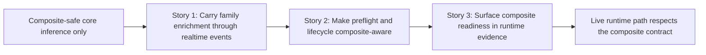

# Story Map: Phase 2 - Make The Live Runtime Respect That Contract

**Date**: 2026-04-05
**Phase Plan**: `history/ids-multiclass-two-stage-runtime-contract/phase-plan.md`
**Phase Contract**: `history/ids-multiclass-two-stage-runtime-contract/phase-2-contract.md`
**Approach Reference**: `history/ids-multiclass-two-stage-runtime-contract/approach.md`

---

## 1. Story Dependency Diagram

---

## 2. Story Table

| Story | What Happens In This Story | Why Now | Contributes To | Creates | Unlocks | Done Looks Like |
|-------|-----------------------------|---------|----------------|---------|---------|-----------------|
| Story 1: Carry family enrichment through realtime events | The realtime pipeline emits the family enrichment fields that Phase 1 added to core inference. | The live runtime path should first prove it can carry the new output contract through event emission. | Exit-state line 1 | Composite-aware realtime event payloads and regression coverage | Story 2 | Realtime pipeline output includes the family fields in composite mode and stays binary-only in legacy mode. |
| Story 2: Make preflight and lifecycle composite-aware | The operational gate and bundle lifecycle treat composite bundles as the canonical production contract and reject bad composite candidates. | Once the live event path uses the contract, the operational gate must validate the same thing. | Exit-state line 2 | Composite-aware preflight/lifecycle behavior and negative-path proofs | Story 3 | Valid composite bundles pass operational checks, bad composite bundles fail closed, and legacy bundles still verify. |
| Story 3: Surface composite readiness in runtime evidence | Health/runtime evidence shows whether the active runtime is composite-ready and what contract is active. | Visibility should reflect the exact contract Story 2 validates and Story 1 exercises. | Exit-state line 3 | Composite-aware readiness/status visibility | Phase 3 | Runtime evidence distinguishes composite-ready and legacy runtime states without inventing a parallel status rule. |

---

## 3. Story Details

### Story 1: Carry family enrichment through realtime events

- **What Happens In This Story**: the realtime scoring/event path starts emitting the family enrichment fields already produced by composite core inference.
- **Why Now**: before lifecycle and health work can be meaningful, the live runtime path itself must use the new output contract.
- **Contributes To**: exit-state line 1.
- **Creates**: composite-aware realtime event payloads and regression tests.
- **Unlocks**: lifecycle/preflight work can validate a runtime path that already emits the intended contract.
- **Done Looks Like**: composite realtime outputs include family fields, and legacy outputs remain binary-only.
- **Candidate Bead Themes**:
  - extend realtime pipeline output assembly
  - pin composite-vs-legacy realtime event payload behavior

### Story 2: Make preflight and lifecycle composite-aware

- **What Happens In This Story**: preflight and bundle lifecycle surfaces start validating composite bundles as the production truth, including fail-closed handling for bad composite candidates.
- **Why Now**: the operational gate should validate the same runtime contract the system now emits.
- **Contributes To**: exit-state line 2 and makes exit-state line 3 meaningful.
- **Creates**: composite-aware preflight/lifecycle checks and regression coverage for broken composite candidates.
- **Unlocks**: health/runtime evidence can safely describe composite readiness without inventing new rules.
- **Done Looks Like**: valid composite bundles pass preflight/verify/status, invalid composite bundles fail closed, and legacy bundles remain supported.
- **Candidate Bead Themes**:
  - update preflight and lifecycle validation to consume the composite contract
  - pin failed-candidate behavior for composite bundles

### Story 3: Surface composite readiness in runtime evidence

- **What Happens In This Story**: runtime evidence and health surfaces expose whether the active bundle is composite-ready and what enriched contract is active.
- **Why Now**: visibility should be a read-only reflection of the contract already exercised by Stories 1 and 2.
- **Contributes To**: exit-state line 3.
- **Creates**: composite-aware health/runtime status payloads and tests.
- **Unlocks**: Phase 3 can harden packaging and rollout around a visible operational contract.
- **Done Looks Like**: health/runtime evidence distinguishes composite-ready and legacy states consistently with the active bundle.
- **Candidate Bead Themes**:
  - extend live runtime health/status payloads
  - pin composite-readiness visibility in tests

---

## 4. Story Order Check

- [x] Story 1 is obviously first
- [x] Every later story builds on or de-risks an earlier story
- [x] If every story reaches "Done Looks Like", the phase exit state should be true

---

## 5. Story-To-Bead Mapping

| Story | Beads | Notes |
|-------|-------|-------|
| Story 1: Carry family enrichment through realtime events | `ids_ml_new-d90e.4` | owns realtime payload propagation and keeps legacy binary outputs intact |
| Story 2: Make preflight and lifecycle composite-aware | `ids_ml_new-d90e.5` | owns operational gate/lifecycle handling and fail-closed candidate checks |
| Story 3: Surface composite readiness in runtime evidence | `ids_ml_new-d90e.6` | consumes the validated contract from Story 2 and exposes read-only runtime evidence |
