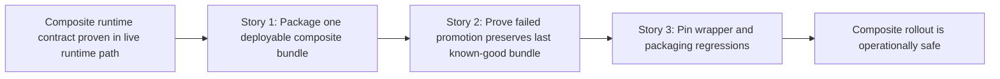

# Phase Contract: Phase 3 - Make Promotion And Rollback Operationally Safe

**Date**: 2026-04-05
**Feature**: `ids-multiclass-two-stage-runtime-contract`
**Phase Plan Reference**: `history/ids-multiclass-two-stage-runtime-contract/phase-plan.md`
**Based on**:
- `history/ids-multiclass-two-stage-runtime-contract/CONTEXT.md`
- `history/ids-multiclass-two-stage-runtime-contract/discovery.md`
- `history/ids-multiclass-two-stage-runtime-contract/approach.md`

---

## 1. What This Phase Changes

This phase turns the composite runtime contract into a normal deployable production artifact. After this phase, the packaging flow can assemble one composite bundle from the selected stage-1 and stage-2 artifacts, promotion can verify and activate that bundle through the canonical lifecycle path, and a failed candidate can be rejected without disturbing the last known-good activation record. Wrapper and packaging regression coverage also expands so the rollout surface stays stable during future refactors.

---

## 2. Why This Phase Exists Now

- Phase 1 proved one composite bundle shape and one scoring seam.
- Phase 2 proved the live runtime, preflight, lifecycle status, and health surfaces can all honor that contract.
- The remaining gap is operational safety: if the bundle cannot be packaged, promoted, rejected, and rolled back predictably, the feature is still a lab-only contract rather than a production-ready one.

---

## 3. Entry State

- Composite bundles can be read, validated, scored, surfaced in realtime events, and described by health/runtime evidence.
- The production packaging flow still centers on the legacy binary final-model bundle.
- Promotion/rollback tests prove lifecycle safety for existing bundle shapes, but they do not yet pin the composite packaging story end to end.
- Wrapper and packaging coverage exists, but it does not yet guarantee the composite rollout surface remains intact.

---

## 4. Exit State

- The packaging flow can assemble one deployable composite bundle artifact from the selected stage-1 and stage-2 production assets without breaking the legacy binary packaging path.
- Promotion and rollback proofs show that a broken composite candidate is rejected and leaves the previously active bundle untouched.
- Wrapper and packaging regression coverage pin the supported rollout surface so composite packaging does not silently narrow module/script compatibility.

**Rule:** every exit-state line must be testable or demonstrable.

---

## 5. Demo Walkthrough

Build a composite bundle artifact with the packaging entrypoint, inspect the resulting `model_bundle.json`, and verify that it references the selected stage-2 checkpoint plus abstention thresholds while preserving the existing binary metadata. Then promote a valid composite candidate and confirm it becomes active. Finally, try a deliberately broken composite candidate and confirm promotion fails closed, the previous active bundle remains active, and status/health still report the last known-good bundle.

### Demo Checklist

- [ ] Package one deployable composite bundle artifact through the supported packaging surface.
- [ ] Verify and activate that composite bundle through the normal lifecycle path.
- [ ] Reject a broken composite candidate without disturbing the active bundle.
- [ ] Prove wrapper/packaging compatibility surfaces still answer correctly after the composite changes.

---

## 6. Story Sequence At A Glance

| Story | What Happens | Why Now | Unlocks Next | Done Looks Like |
|-------|--------------|---------|--------------|-----------------|
| Story 1: Package the selected stage-2 checkpoint into one deployable composite bundle | The production packaging flow can assemble the chosen stage-2 model, schema, labels, and thresholds into one deployable composite bundle while preserving the legacy binary packaging path. | The artifact must exist before promotion and rollback can be proven against the real deployable surface. | Story 2 can exercise real composite promotion and failure handling. | Packaging tests prove a composite bundle artifact is emitted with the expected manifest and source references, and the legacy path still works. |
| Story 2: Prove failed promotion preserves the last known-good bundle | Promotion and rollback tests show that a broken composite candidate never disturbs the active verified bundle. | Once a real composite artifact exists, lifecycle hardening can target the real deployment path rather than synthetic fixtures only. | Story 3 can lock rollout compatibility around a proven safe operational contract. | Lifecycle tests prove valid composite promotion succeeds, invalid composite promotion fails closed, and rollback/status still reflect the last known-good bundle. |
| Story 3: Pin wrapper, packaging, and migration regressions | Direct and compatibility wrappers keep exposing the supported packaging/management surfaces after the composite rollout changes. | The rollout surface is only shippable if packaging and manage wrappers remain executable contracts. | Final review / ship. | Wrapper and packaging smoke/tests fail if composite packaging narrows supported module/script entrypoints or installable surface expectations. |

---

## 7. Phase Diagram

---

## 8. Out Of Scope

- Console/UI/storage changes for family enrichment.
- Retuning or retraining the stage-2 family classifier.
- New rollout channels beyond the existing local packaging and activation lifecycle surfaces.

---

## 9. Success Signals

- A composite bundle can be built through the supported packaging path and verified/promoted with no extra operator-only seam.
- A broken composite candidate demonstrably fails closed while the active bundle and health surfaces remain on the last known-good state.
- Compatibility wrappers still answer on the supported module/script surfaces after the packaging changes.

---

## 10. Failure / Pivot Signals

- If composite packaging requires a second untracked sidecar output instead of one deployable bundle root, the production contract has drifted.
- If failed composite promotion mutates the active bundle record before verification is complete, this phase must stop and harden rollback before review.
- If packaging or manage wrappers stop exposing their supported help/entrypoint surfaces, migration safety is not real and the phase is not done.
