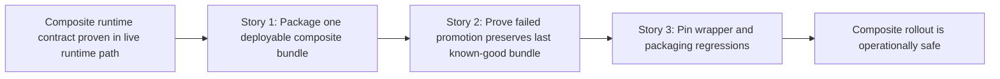

# Story Map: Phase 3 - Make Promotion And Rollback Operationally Safe

**Date**: 2026-04-05
**Phase Plan**: `history/ids-multiclass-two-stage-runtime-contract/phase-plan.md`
**Phase Contract**: `history/ids-multiclass-two-stage-runtime-contract/phase-3-contract.md`
**Approach Reference**: `history/ids-multiclass-two-stage-runtime-contract/approach.md`

---

## 1. Story Dependency Diagram

---

## 2. Story Table

| Story | What Happens In This Story | Why Now | Contributes To | Creates | Unlocks | Done Looks Like |
|-------|-----------------------------|---------|----------------|---------|---------|-----------------|
| Story 1: Package the selected stage-2 checkpoint into one deployable composite bundle | The packaging entrypoint can emit a composite bundle root that includes stage-1 and stage-2 artifacts plus abstention thresholds. | The deployable artifact must exist before lifecycle safety can be proven against real packaging output. | Exit-state line 1 | Composite packaging path and regression coverage for emitted manifest/source references | Story 2 | A composite bundle artifact is built through the supported packaging surface and the legacy binary packaging path remains intact. |
| Story 2: Prove failed promotion preserves the last known-good bundle | Promotion/rollback tests target real composite candidates and prove bad candidates do not disturb the active verified bundle. | Once the packaging path emits real composite bundles, lifecycle hardening can prove the deploy contract is safe. | Exit-state line 2 | Composite promotion/rollback proofs and negative-path coverage | Story 3 | Valid composite promotion succeeds, invalid promotion fails closed, and status/rollback stay anchored to the previous good bundle. |
| Story 3: Pin wrapper, packaging, and migration regressions | Packaging/manage wrappers and installable-surface expectations stay executable after the composite packaging changes. | The rollout path is only shippable if the exposed entrypoints remain stable. | Exit-state line 3 | Wrapper-smoke and packaging-compatibility proofs | Review / ship | Tests fail if composite rollout breaks supported module/script wrappers or narrows installable packaging expectations. |

---

## 3. Story Details

### Story 1: Package the selected stage-2 checkpoint into one deployable composite bundle

- **What Happens In This Story**: the production packager learns how to emit one composite bundle root containing stage-1 and stage-2 artifacts, closed-set labels, and abstention thresholds.
- **Why Now**: promotion/rollback cannot be proven operationally until there is a real packaged composite candidate to promote.
- **Contributes To**: exit-state line 1.
- **Creates**: composite packaging output and regression tests around its manifest and source references.
- **Unlocks**: Story 2 can exercise lifecycle safety against the real packaging surface.
- **Done Looks Like**: packaging tests show a composite bundle artifact is produced with the correct contract metadata while the legacy binary path still works.
- **Candidate Bead Themes**:
  - extend package-final-model flow for composite bundles
  - pin composite manifest/source metadata in packaging tests

### Story 2: Prove failed promotion preserves the last known-good bundle

- **What Happens In This Story**: lifecycle tests prove a bad composite candidate is rejected without disturbing the active bundle and that rollback/status still reflect the last known-good record.
- **Why Now**: once the packager can emit composite candidates, the lifecycle path must prove it can reject them safely.
- **Contributes To**: exit-state line 2.
- **Creates**: composite promotion/rollback negative-path proofs.
- **Unlocks**: Story 3 can harden compatibility on top of a proven-safe rollout path.
- **Done Looks Like**: manage/lifecycle tests prove good composite promotion succeeds, bad composite promotion fails closed, and rollback/status stay correct.
- **Candidate Bead Themes**:
  - extend lifecycle/manage tests to real composite candidates
  - pin last-known-good behavior after failed composite promotion

### Story 3: Pin wrapper, packaging, and migration regressions

- **What Happens In This Story**: wrapper and installable-surface tests prove the supported packaging and manage entrypoints still work after the composite rollout changes.
- **Why Now**: these wrappers are part of the deploy contract and are easiest to pin after the real packaging/lifecycle behavior stabilizes.
- **Contributes To**: exit-state line 3.
- **Creates**: wrapper-smoke and packaging-compatibility proofs for the rollout surface.
- **Unlocks**: final review.
- **Done Looks Like**: wrapper/installable-surface tests fail if composite rollout breaks supported module/script entrypoints or package metadata expectations.
- **Candidate Bead Themes**:
  - expand ML wrapper smoke around package-final-model
  - pin installable/entrypoint expectations that composite packaging depends on

---

## 4. Story Order Check

- [x] Story 1 is obviously first
- [x] Every later story builds on or de-risks an earlier story
- [x] If every story reaches "Done Looks Like", the phase exit state should be true

---

## 5. Story-To-Bead Mapping

| Story | Beads | Notes |
|-------|-------|-------|
| Story 1: Package the selected stage-2 checkpoint into one deployable composite bundle | `ids_ml_new-d90e.8` | owns packager changes and packaging tests; gated by spike `ids_ml_new-d90e.11` |
| Story 2: Prove failed promotion preserves the last known-good bundle | `ids_ml_new-d90e.9` | owns lifecycle/manage negative-path proofs against composite candidates |
| Story 3: Pin wrapper, packaging, and migration regressions | `ids_ml_new-d90e.10` | owns wrapper/installable-surface regression coverage for the rollout surface |
